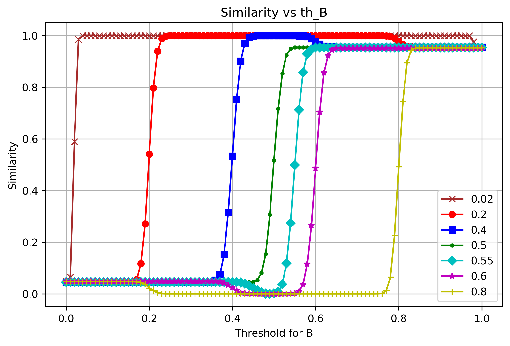
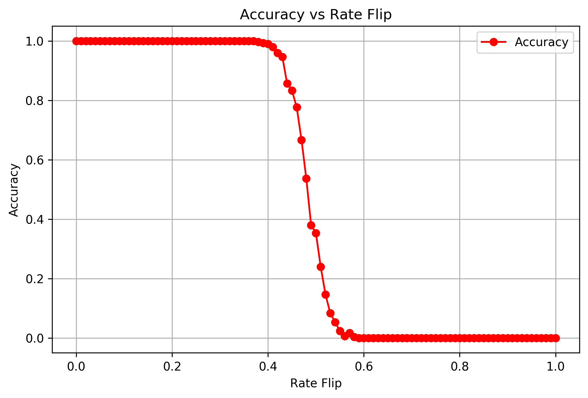
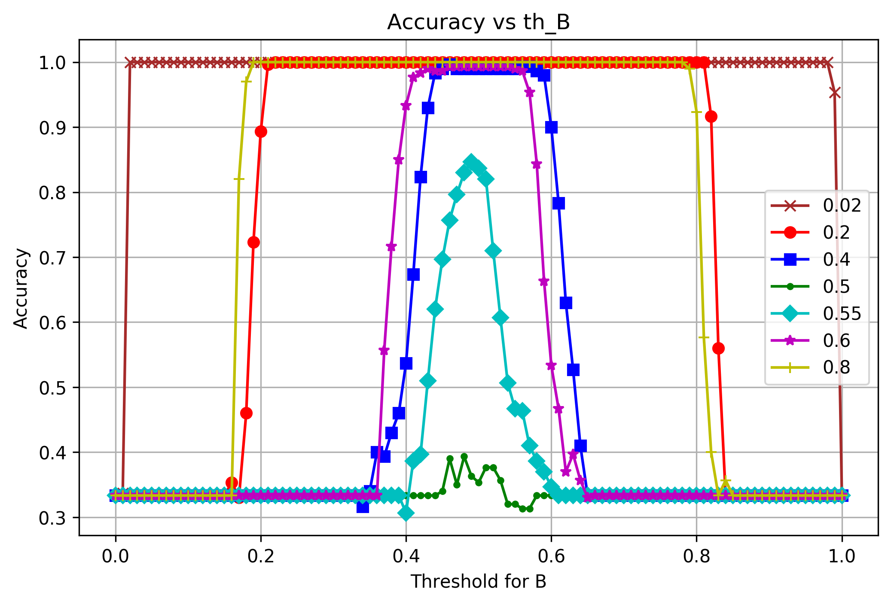
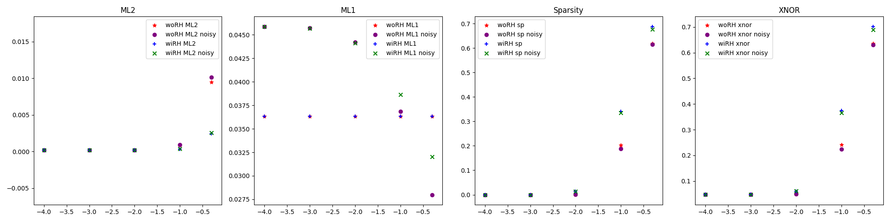
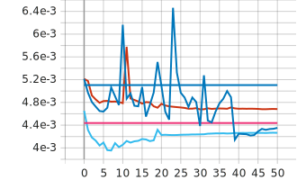
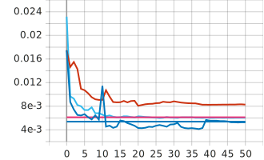

## 25/04/02
### 3. NUCLA statistics for setting threshold

### * Try simple BNN(1-Bit WaveNet)
WaveNet: input patches: $d_p x w_p x h_p x c_p(256?x7x7x3)$
Coefficients: input patches: $d_p x w_p x h_p x c_p(161x5x5x2)$

## 25/03/31
### 2.recover B from B_flip using SYNTH data, similarity
```bash
python 20250321_exp_cls_syn_B.py --mode stat_sim > notes_exp/20250320_syn_C/20250331_stat-sim.log
```
\
while the threshold is lower than the flip rate, all binary codes are set to 1, acc low
above the flip rate all codes are set to 0, acc high


# 25/03/26
## 10 mostly used poles for each column
```bash
(pyenv_1.6) 2501_SBAR$ python test_cls_CV_DIR_xnor.py --sampling Multi --nClip 6 --wiRH 1 --wiBI 1 --pret /data/Dan/202501_SBAR/3_MSECB-ML1CB_desc/0_250210_clamp_LASSO-Loss/lamf1e-2_gth505_lam2-5e-1_a1e-2_bs32_clamp_lr2-1e-2/NUCLA_CV_setup1_Multi/DIR_D_LossR_B_wiRH_wiBI/dir_d_5.pth --bs 32 --gpu_id 1 --lam_f 1e-2 --g_th 0.505 --lam2 5e-1 --Alpha 1e-2 --lr_2 1e-2
Wed Mar 26 11:04:36 EDT 2025
 dy+bi | LossR_B_wiRH_wiBI | Batch Size: Train 32 | Test 32 | Sample Multi(nClip-6)
         lam_f: 0.01 | r_r: 0.8,1.1 | r_t: 0,pi | g_th: 0.505 | g_te: 0.1
         Alpha: 0.01 | lam2: 0.5 | lr_2: 0.01(milestone: [20, 40])
Test epoch: Namespace(Alpha=0.01, AlphaP=100.0, Epoch=50, N=80, T=36, bs=32, bs_t=32, cls='l2', cus_n='', dataType='2D', g_te=0.1, g_th=0.505, gpu_id=1, lam2=0.5, lam_f=0.01, lr_2=0.01, mode='dy+bi', modelRoot='exps_should_be_saved_on_HDD', ms=[20, 40], nClip=6, nw=8, path_list='./', pret='/data/Dan/202501_SBAR/3_MSECB-ML1CB_desc/0_250210_clamp_LASSO-Loss/lamf1e-2_gth505_lam2-5e-1_a1e-2_bs32_clamp_lr2-1e-2/NUCLA_CV_setup1_Multi/DIR_D_LossR_B_wiRH_wiBI/dir_d_5.pth', r_r='0.8,1.1', r_t='0,pi', sampling='Multi', setup='setup1', wiBI=True, wiRH=True) loss: 0.004151278 L1_C: 0.007536088 L1_C_B: 0.004144731 mseC: 0.00013279504 L1_B: 0.021062808 mseB: 0.008219662 Sp_0:0.1967948079109192 Sp_th:0.9819076061248779
0.3878550440744368
0.21767241379310345
```
## Compare to the original one using all poles
```bash
(pyenv_1.6) 2501_SBAR$ python test_cls_CV_DIR_xnor.py --sampling Multi --nClip 6 --wiRH 1 --wiBI 1 --pret /data/Dan/202501_SBAR/3_MSECB-ML1CB_desc/0_250210_clamp_LASSO-Loss/lamf1e-2_gth505_lam2-5e-1_a1e-2_bs32_clamp_lr2-1e-2/NUCLA_CV_setup1_Multi/DIR_D_LossR_B_wiRH_wiBI/dir_d_5.pth --bs 32 --gpu_id 1 --lam_f 1e-2 --g_th 0.505 --lam2 5e-1 --Alpha 1e-2 --lr_2 1e-2
Wed Mar 26 11:07:35 EDT 2025
 dy+bi | LossR_B_wiRH_wiBI | Batch Size: Train 32 | Test 32 | Sample Multi(nClip-6)
         lam_f: 0.01 | r_r: 0.8,1.1 | r_t: 0,pi | g_th: 0.505 | g_te: 0.1
         Alpha: 0.01 | lam2: 0.5 | lr_2: 0.01(milestone: [20, 40])
Test epoch: Namespace(Alpha=0.01, AlphaP=100.0, Epoch=50, N=80, T=36, bs=32, bs_t=32, cls='l2', cus_n='', dataType='2D', g_te=0.1, g_th=0.505, gpu_id=1, lam2=0.5, lam_f=0.01, lr_2=0.01, mode='dy+bi', modelRoot='exps_should_be_saved_on_HDD', ms=[20, 40], nClip=6, nw=8, path_list='./', pret='/data/Dan/202501_SBAR/3_MSECB-ML1CB_desc/0_250210_clamp_LASSO-Loss/lamf1e-2_gth505_lam2-5e-1_a1e-2_bs32_clamp_lr2-1e-2/NUCLA_CV_setup1_Multi/DIR_D_LossR_B_wiRH_wiBI/dir_d_5.pth', r_r='0.8,1.1', r_t='0,pi', sampling='Multi', setup='setup1', wiBI=True, wiRH=True) loss: 0.004151278 L1_C: 0.007536088 L1_C_B: 0.004144731 mseC: 0.00013279504 L1_B: 0.021062808 mseB: 0.008219662 Sp_0:0.1967948079109192 Sp_th:0.9819076061248779
0.09990205680705191
0.10129310344827586
```
## mid clip, 10 mostly used poles
```bash
(pyenv_1.6) 2501_SBAR$ python test_cls_CV_DIR_xnor.py --sampling Multi --nClip 6 --wiRH 1 --wiBI 1 --pret /data/Dan/202501_SBAR/3_MSECB-ML1CB_desc/2_250225_clamp_LASSO-Loss/lamf1e-1_gth505_lam2-5e-1_a1e-1_bs32_clamp_lr2-1e-3/NUCLA_CV_setup1_Multi/DIR_D_LossR_B_wiRH_wiBI/dir_d_8.pth --bs 32 --gpu_id 1 --lam_f 1e-1 --g_th 0.505 --lam2 5e-1 --Alpha 1e-1 --lr_2 1e-3
Thu Mar 27 10:25:12 EDT 2025
 dy+bi | LossR_B_wiRH_wiBI | Batch Size: Train 32 | Test 32 | Sample Multi(nClip-6)
         lam_f: 0.1 | r_r: 0.8,1.1 | r_t: 0,pi | g_th: 0.505 | g_te: 0.1
         Alpha: 0.1 | lam2: 0.5 | lr_2: 0.001(milestone: [20, 40])
Test epoch: Namespace(Alpha=0.1, AlphaP=100.0, Epoch=50, N=80, T=36, bs=32, bs_t=32, cls='l2', cus_n='', dataType='2D', g_te=0.1, g_th=0.505, gpu_id=1, lam2=0.5, lam_f=0.1, lr_2=0.001, mode='dy+bi', modelRoot='exps_should_be_saved_on_HDD', ms=[20, 40], nClip=6, nw=8, path_list='./', pret='/data/Dan/202501_SBAR/3_MSECB-ML1CB_desc/2_250225_clamp_LASSO-Loss/lamf1e-1_gth505_lam2-5e-1_a1e-1_bs32_clamp_lr2-1e-3/NUCLA_CV_setup1_Multi/DIR_D_LossR_B_wiRH_wiBI/dir_d_8.pth', r_r='0.8,1.1', r_t='0,pi', sampling='Multi', setup='setup1', wiBI=True, wiRH=True) loss: 0.0033102562 L1_C: 0.0056827497 L1_C_B: 0.0046766875 mseC: 0.00013308966 L1_B: 0.029030932 mseB: 0.0056851753 Sp_0:0.8321204781532288 Sp_th:0.9731519818305969
0.3525954946131244
0.2349137931034483
```

## 25/03/24
### 1.baseline
visualization: rate_flip(x)/acc(y)
```bash
(pyenv_1.6) 2501_SBAR$ python 20250321_exp_cls_syn_B.py --mode baseline > notes_exp/20250320_syn_C/20250328_baseline_log.log
```


### 2.recover B from B_flip using SYNTH data, label accuracy
#### while rate_flip=10%, one sample
```bash
ipdb> B_templates[0,:,0]
tensor([0.0844, 0.0944, 0.1044, 0.0944, 0.1078, 0.0889, 0.0900, 0.1056, 0.1044,
        0.0989, 0.0944, 0.1044, 0.0956, 0.1022, 0.0956, 0.0844, 0.0978, 0.1000,
        0.1000, 0.1056, 0.0833, 0.0989, 0.1133, 0.1067, 0.0956, 0.0989, 0.0989,
        0.1089, 0.1000, 0.1067, 0.0856, 0.1067, 0.0856, 0.0967, 0.1011, 0.1011,
        0.0978, 0.0967, 0.0933, 0.1022, 0.0878, 0.0878, 0.1100, 0.1089, 0.0978,
        0.1100, 0.1167, 0.0822, 0.1033, 0.0867, 0.0978, 0.0978, 0.0900, 0.0989,
        0.0978, 0.0967, 0.0933, 0.9044, 0.9000, 0.1156, 0.9156, 0.0911, 0.1022,
        0.9067, 0.1067, 0.1078, 0.0789, 0.1067, 0.8889, 0.0933, 0.1089, 0.1067,
        0.1089, 0.1200, 0.1000, 0.1056, 0.1078, 0.0811, 0.0911, 0.0967, 0.0967,
        0.1244, 0.8811, 0.0911, 0.1000, 0.0900, 0.1000, 0.0711, 0.1067, 0.1056,
        0.1033, 0.1200, 0.8989, 0.0911, 0.1033, 0.0944, 0.1200, 0.1233, 0.0944,
        0.0878, 0.1133, 0.9144, 0.1122, 0.1189, 0.0956, 0.1000, 0.1056, 0.1156,
        0.0889, 0.1078, 0.1078, 0.1022, 0.0944, 0.1122, 0.1144, 0.0878, 0.1133,
        0.0944, 0.0978, 0.0944, 0.0989, 0.1056, 0.1111, 0.0956, 0.0978, 0.0911,
        0.1067, 0.1144, 0.1044, 0.1067, 0.1100, 0.8989, 0.0922, 0.1067, 0.1000,
        0.1056, 0.1067, 0.0978, 0.1000, 0.1044, 0.1056, 0.0967, 0.0944, 0.1033,
        0.0967, 0.1000, 0.1144, 0.0922, 0.1178, 0.0822, 0.1000, 0.0989, 0.0856,
        0.1033, 0.1011, 0.1067, 0.0878, 0.1011, 0.1089, 0.1100, 0.0944])
```
```bash
(pyenv_1.6) 2501_SBAR$ python 20250321_exp_cls_syn_B.py --mode stat > notes_exp/20250320_syn_C/20250328_stat-cls.log
```


### 3.choose g_th based on g_th


# 25/03/20 CLS for Binary Code
## exp based synthetic Binary inputs
1) 3 Binary templates for 3 different classes
2) generate samples based on templates\
	- 1000 samples based on templates, among those flip 2% to the opposite\
	- train/test 9:1
3) pass through classifier
	- baseline - max XNOR with templates
		```python
		(pyenv_1.6) 2501_SBAR$ python 20250321_exp_cls_syn_B.py --mode baseline --rate_flip 0.30
		20250321_exp_cls_syn_B.py:117: UserWarning: __floordiv__ is deprecated, and its behavior will change in a future version of pytorch. It currently rounds toward 0 (like the 'trunc' function NOT 'floor'). This results in incorrect rounding for negative values. To keep the current behavior, use torch.div(a, b, rounding_mode='trunc'), or for actual floor division, use torch.div(a, b, rounding_mode='floor').
		ids_row = indices // dim_data
		rate_flip: 0.3 acc: 1.0000
		(pyenv_1.6) 2501_SBAR$ python 20250321_exp_cls_syn_B.py --mode baseline --rate_flip 0.10
		20250321_exp_cls_syn_B.py:117: UserWarning: __floordiv__ is deprecated, and its behavior will change in a future version of pytorch. It currently rounds toward 0 (like the 'trunc' function NOT 'floor'). This results in incorrect rounding for negative values. To keep the current behavior, use torch.div(a, b, rounding_mode='trunc'), or for actual floor division, use torch.div(a, b, rounding_mode='floor').
		ids_row = indices // dim_data
		rate_flip: 0.1 acc: 1.0000
		(pyenv_1.6) 2501_SBAR$ python 20250321_exp_cls_syn_B.py --mode baseline --rate_flip 0.02
		20250321_exp_cls_syn_B.py:117: UserWarning: __floordiv__ is deprecated, and its behavior will change in a future version of pytorch. It currently rounds toward 0 (like the 'trunc' function NOT 'floor'). This results in incorrect rounding for negative values. To keep the current behavior, use torch.div(a, b, rounding_mode='trunc'), or for actual floor division, use torch.div(a, b, rounding_mode='floor').
		ids_row = indices // dim_data
		rate_flip: 0.02 acc: 1.0000
		```
	- MLP - BiMLP

# 25/02/28
1) dif poles used for XNOR vis
	- center clip
	- 5 samples, same action
2) code bugs
	- testing
		```python
		# test_cls_CV_DIR_xnor_syn_data.py#L246
		correct = torch.eq(gt, gt).int() # test debug
		```
		```bash
		python test_cls_CV_DIR_xnor.py --sampling Multi --nClip 6 --wiRH 1 --wiBI 1 --pret /data/Dan/202501_SBAR/3_MSECB-ML1CB_desc/0_250210_clamp_LASSO-Loss/lamf1e-2_gth505_lam2-5e-1_a1e-2_bs32_clamp_lr2-1e-2/NUCLA_CV_setup1_Multi/DIR_D_LossR_B_wiRH_wiBI/dir_d_5.pth --bs 32 --gpu_id 1 --lam_f 1e-2 --g_th 0.505 --lam2 5e-1 --Alpha 1e-2 --lr_2 1e-2
		Tue Mar  4 15:08:25 EST 2025
 		 dy+bi | LossR_B_wiRH_wiBI | Batch Size: Train 32 | Test 32 | Sample Multi(nClip-6)
         lam_f: 0.01 | r_r: 0.8,1.1 | r_t: 0,pi | g_th: 0.505 | g_te: 0.1
         Alpha: 0.01 | lam2: 0.5 | lr_2: 0.01(milestone: [20, 40])
		Test epoch: Namespace(Alpha=0.01, AlphaP=100.0, Epoch=50, N=80, T=36, bs=32, bs_t=32, cls='l2', cus_n='', dataType='2D', g_te=0.1, g_th=0.505, gpu_id=1, lam2=0.5, lam_f=0.01, lr_2=0.01, mode='dy+bi', modelRoot='exps_should_be_saved_on_HDD', ms=[20, 40], nClip=6, nw=8, path_list='./', pret='/data/Dan/202501_SBAR/3_MSECB-ML1CB_desc/0_250210_clamp_LASSO-Loss/lamf1e-2_gth505_lam2-5e-1_a1e-2_bs32_clamp_lr2-1e-2/NUCLA_CV_setup1_Multi/DIR_D_LossR_B_wiRH_wiBI/dir_d_5.pth', r_r='0.8,1.1', r_t='0,pi', sampling='Multi', setup='setup1', wiBI=True, wiRH=True) loss: 0.004151278 L1_C: 0.007536088 L1_C_B: 0.004144731 mseC: 0.00013279504 L1_B: 0.021062808 mseB: 0.008219662 Sp_0:0.1967948079109192 Sp_th:0.9819076061248779
		1.0
		1.0
		```
3) dif g_th
	```bash
	python train_DIR_D_NUCLA.py  --modelRoot /data/Dan/202501_SBAR/3_MSECB-ML1CB_desc/3_250228_clamp_LASSO-Loss/lamf1e-2_gth510_lam2-5e-1_a1e-2_bs32_clamp_lr2-1e-2 --sampling Multi --nClip 6 --wiRH 1 --wiBI 1 --bs 32 --gpu_id 7 --lam_f 1e-2 --g_th 0.510 --lam2 5e-1 --Alpha 1e-2 --lr_2 1e-2 > /data/Dan/202501_SBAR/3_MSECB-ML1CB_desc/3_250228_clamp_LASSO-Loss/3_MSECB-ML1CB_3_lamf1e-2_gth510_lam2-5e-1_a1e-2_bs32_clamp_lr2-1e-2.log

	python train_DIR_D_NUCLA.py  --modelRoot /data/Dan/202501_SBAR/3_MSECB-ML1CB_desc/3_250228_clamp_LASSO-Loss/lamf1e-2_gth550_lam2-5e-1_a1e-2_bs32_clamp_lr2-1e-2 --sampling Multi --nClip 6 --wiRH 1 --wiBI 1 --bs 32 --gpu_id 0 --lam_f 1e-2 --g_th 0.550 --lam2 5e-1 --Alpha 1e-2 --lr_2 1e-2 > /data/Dan/202501_SBAR/3_MSECB-ML1CB_desc/3_250228_clamp_LASSO-Loss/3_MSECB-ML1CB_3_lamf1e-2_gth550_lam2-5e-1_a1e-2_bs32_clamp_lr2-1e-2.log

	python train_DIR_D_NUCLA.py  --modelRoot /data/Dan/202501_SBAR/3_MSECB-ML1CB_desc/3_250228_clamp_LASSO-Loss/lamf1e-2_gth600_lam2-5e-1_a1e-2_bs32_clamp_lr2-1e-2 --sampling Multi --nClip 6 --wiRH 1 --wiBI 1 --bs 32 --gpu_id 6 --lam_f 1e-2 --g_th 0.600 --lam2 5e-1 --Alpha 1e-2 --lr_2 1e-2 > /data/Dan/202501_SBAR/3_MSECB-ML1CB_desc/3_250228_clamp_LASSO-Loss/3_MSECB-ML1CB_3_lamf1e-2_gth600_lam2-5e-1_a1e-2_bs32_clamp_lr2-1e-2.log

	python train_DIR_D_NUCLA.py  --modelRoot /data/Dan/202501_SBAR/3_MSECB-ML1CB_desc/3_250228_clamp_LASSO-Loss/lamf1e-2_gth700_lam2-5e-1_a1e-2_bs32_clamp_lr2-1e-2 --sampling Multi --nClip 6 --wiRH 1 --wiBI 1 --bs 32 --gpu_id 1 --lam_f 1e-2 --g_th 0.700 --lam2 5e-1 --Alpha 1e-2 --lr_2 1e-2 > /data/Dan/202501_SBAR/3_MSECB-ML1CB_desc/3_250228_clamp_LASSO-Loss/3_MSECB-ML1CB_3_lamf1e-2_gth700_lam2-5e-1_a1e-2_bs32_clamp_lr2-1e-2.log

	python train_DIR_D_NUCLA.py  --modelRoot /data/Dan/202501_SBAR/3_MSECB-ML1CB_desc/3_250228_clamp_LASSO-Loss/lamf1e-2_gth800_lam2-5e-1_a1e-2_bs32_clamp_lr2-1e-2 --sampling Multi --nClip 6 --wiRH 1 --wiBI 1 --bs 32 --gpu_id 5 --lam_f 1e-2 --g_th 0.800 --lam2 5e-1 --Alpha 1e-2 --lr_2 1e-2 > /data/Dan/202501_SBAR/3_MSECB-ML1CB_desc/3_250228_clamp_LASSO-Loss/3_MSECB-ML1CB_3_lamf1e-2_gth800_lam2-5e-1_a1e-2_bs32_clamp_lr2-1e-2.log

	python train_DIR_D_NUCLA.py  --modelRoot /data/Dan/202501_SBAR/3_MSECB-ML1CB_desc/3_250228_clamp_LASSO-Loss/lamf1e-2_gth900_lam2-5e-1_a1e-2_bs32_clamp_lr2-1e-2 --sampling Multi --nClip 6 --wiRH 1 --wiBI 1 --bs 32 --gpu_id 2 --lam_f 1e-2 --g_th 0.900 --lam2 5e-1 --Alpha 1e-2 --lr_2 1e-2 > /data/Dan/202501_SBAR/3_MSECB-ML1CB_desc/3_250228_clamp_LASSO-Loss/3_MSECB-ML1CB_3_lamf1e-2_gth900_lam2-5e-1_a1e-2_bs32_clamp_lr2-1e-2.log

	python train_DIR_D_NUCLA.py  --modelRoot /data/Dan/202501_SBAR/3_MSECB-ML1CB_desc/3_250228_clamp_LASSO-Loss/lamf1e-2_gth910_lam2-5e-1_a1e-2_bs32_clamp_lr2-1e-2 --sampling Multi --nClip 6 --wiRH 1 --wiBI 1 --bs 32 --gpu_id 3 --lam_f 1e-2 --g_th 0.910 --lam2 5e-1 --Alpha 1e-2 --lr_2 1e-2 > /data/Dan/202501_SBAR/3_MSECB-ML1CB_desc/3_250228_clamp_LASSO-Loss/3_MSECB-ML1CB_3_lamf1e-2_gth910_lam2-5e-1_a1e-2_bs32_clamp_lr2-1e-2.log

	python train_DIR_D_NUCLA.py  --modelRoot /data/Dan/202501_SBAR/3_MSECB-ML1CB_desc/3_250228_clamp_LASSO-Loss/lamf1e-2_gth950_lam2-5e-1_a1e-2_bs32_clamp_lr2-1e-2 --sampling Multi --nClip 6 --wiRH 1 --wiBI 1 --bs 32 --gpu_id 4 --lam_f 1e-2 --g_th 0.950 --lam2 5e-1 --Alpha 1e-2 --lr_2 1e-2 > /data/Dan/202501_SBAR/3_MSECB-ML1CB_desc/3_250228_clamp_LASSO-Loss/3_MSECB-ML1CB_3_lamf1e-2_gth950_lam2-5e-1_a1e-2_bs32_clamp_lr2-1e-2.log
	```


4) synthetic data
	- step 0. test conjugated poles' coefficients
		```bash
		(pyenv_1.6) 2501_SBAR$ python test_cls_CV_DIR_xnor.py --sampling Multi --nClip 6 --wiRH 1 --wiBI 1 --pret /data/Dan/202501_SBAR/3_MSECB-ML1CB_desc/0_250210_clamp_LASSO-Loss/lamf1e-2_gth505_lam2-5e-1_a1e-2_bs32_clamp_lr2-1e-2/NUCLA_CV_setup1_Multi/DIR_D_LossR_B_wiRH_wiBI/dir_d_5.pth --bs 32 --gpu_id 1 --lam_f 1e-2 --g_th 0.505 --lam2 5e-1 --Alpha 1e-2 --lr_2 1e-2
		Thu Mar 13 04:49:14 EDT 2025
		dy+bi | LossR_B_wiRH_wiBI | Batch Size: Train 32 | Test 32 | Sample Multi(nClip-6)
				lam_f: 0.01 | r_r: 0.8,1.1 | r_t: 0,pi | g_th: 0.505 | g_te: 0.1
				Alpha: 0.01 | lam2: 0.5 | lr_2: 0.01(milestone: [20, 40])
		> /home/dan/ws/202411_SBAR/2501_SBAR/test_cls_CV_DIR_xnor.py(182)train_B_A()
			181             # record B
		--> 182             for i_clip in range(B.shape[0]):
			183                 B_A[gt[i_clip//args.nClip],:,:] += B[i_clip]

		ipdb> C[0,:,0]
		tensor([ 4.9235e-01,  4.0319e-04, -6.8025e-03, -5.5975e-03,  0.0000e+00,
				-9.7519e-03,  1.0008e-03, -8.5842e-03, -5.4980e-03, -2.5088e-04,
				1.1609e-02, -1.5523e-02, -1.8127e-03, -4.2881e-03, -4.3301e-03,
				0.0000e+00, -3.1056e-03, -9.6166e-03, -4.9458e-04, -5.4049e-03,
				-2.3095e-02,  1.1455e-02,  5.3362e-02,  1.8172e-03, -9.5673e-03,
				-7.8695e-03, -1.9314e-02,  6.8827e-04, -1.6926e-03, -1.1643e-02,
				-2.3720e-03, -9.8678e-03, -2.7546e-02,  8.5820e-03,  7.4721e-03,
				-3.1287e-02, -4.7053e-04, -1.5724e-02,  2.0900e-04, -5.2578e-03,
				-1.1796e-03, -3.1819e-03, -3.4659e-03, -1.7675e-02,  1.6574e-03,
				-7.8948e-03, -1.3907e-04, -1.9898e-03, -1.6793e-04,  3.3157e-04,
				-6.6714e-04,  2.7888e-02, -4.0796e-02, -2.1992e-02, -7.4574e-03,
				-1.2654e-02, -1.0062e-02, -3.6390e-04, -8.0862e-03, -4.4279e-04,
				-3.8696e-03, -1.7465e-02,  8.4349e-04, -6.2936e-03, -9.6398e-03,
				2.3056e-04,  6.3293e-03, -2.3016e-03, -4.9980e-04, -1.4280e-02,
				5.1080e-02, -6.9261e-02,  1.0803e-02,  7.3340e-04, -3.0910e-03,
				-1.0018e-02, -6.4704e-03,  1.3189e-02, -4.6028e-04, -3.5464e-03,
				1.1312e-02,  2.1119e-04, -8.6055e-03, -5.3237e-04, -6.2877e-03,
				-5.2318e-03, -1.2511e-02, -3.9400e-03,  0.0000e+00,  3.2093e-04,
				-5.6675e-03, -1.6762e-02, -9.8442e-05,  8.1011e-04, -1.8857e-04,
				-9.6984e-04,  6.2575e-03,  0.0000e+00, -5.9570e-03,  0.0000e+00,
				-1.6480e-02, -6.4641e-04, -2.9771e-01, -1.2547e-02,  1.9263e-02,
				8.9779e-05,  2.9858e-03,  5.8997e-04, -1.2935e-02,  7.9026e-03,
				-7.6292e-05,  8.2322e-03, -6.6250e-02, -2.1231e-02,  3.4953e-04,
				6.3160e-03, -5.4713e-04, -8.5928e-03, -7.4197e-04,  9.4052e-04,
				-3.9659e-04, -2.0038e-03,  2.8578e-04,  4.0932e-04, -1.4477e-02,
				3.2256e-03, -2.5701e-02,  2.9379e-04,  6.4608e-05,  8.4271e-03,
				-4.5110e-03, -2.1019e-02,  1.8098e-04, -5.2138e-03, -1.0089e-01,
				1.5186e-04, -6.4260e-03,  6.7537e-04,  9.1526e-03, -7.4965e-03,
				-3.8792e-05, -1.9081e-03, -6.9768e-03,  2.5584e-05,  1.4873e-04,
				-6.1682e-04, -1.1078e-02, -2.2841e-03, -2.3961e-03, -7.6572e-03,
				-3.3475e-02,  1.3172e-02, -3.8048e-02, -2.6824e-04, -5.2529e-04,
				1.1120e-02,  0.0000e+00, -2.6775e-02, -3.9932e-04, -7.4177e-02,
				-1.1490e-02], device='cuda:1')
		ipdb> C[0,(1,81),0]
		tensor([0.0004, 0.0002], device='cuda:1')
		ipdb> C[0,(80,160),0]
		tensor([ 0.0113, -0.0115], device='cuda:1')
		ipdb> C[0,(79,159),0]
		tensor([-0.0035, -0.0742], device='cuda:1')
		ipdb> q
		```
	- step 1. pretrained/random Dictionary
	- step 2. synthesize $\hat{C}$, [3,161,10], for each column, random rows(5-10) are non-zero
	- step 3. synthesize Y
		- $ \hat{Y}=D\hat{C}$
		- $ \hat{Y}_{noisy}=D\hat{C}+0.01*\delta$, where $\delta \in U(0,1)$
	- step 4. solve C using FISTA/rhFISTA
		- rhFISTA
			```bash
			(pyenv_1.6) 2501_SBAR$ python test_cls_CV_DIR_xnor_syn_data.py --sampling Multi --nClip 6 --wiRH 1 --wiBI 1 --pret /data/Dan/202501_SBAR/3_MSECB-ML1CB_desc/0_250210_clamp_LASSO-Loss/lamf1e-2_gth505_lam2-5e-1_a1e-2_bs32_clamp_lr2-1e-2/NUCLA_CV_setup1_Multi/DIR_D_LossR_B_wiRH_wiBI/dir_d_5.pth --bs 32 --gpu_id 1 --lam_f 1e-3 --g_th 0.505 --lam2 5e-1 --Alpha 1e-2 --lr_2 1e-2
			Fri Mar 14 01:39:13 EDT 2025
			dy+bi | LossR_B_wiRH_wiBI | Batch Size: Train 32 | Test 32 | Sample Multi(nClip-6)
					lam_f: 0.001 | r_r: 0.8,1.1 | r_t: 0,pi | g_th: 0.505 | g_te: 0.1
					Alpha: 0.01 | lam2: 0.5 | lr_2: 0.01(milestone: [20, 40])
			> /home/dan/ws/202411_SBAR/2501_SBAR/test_cls_CV_DIR_xnor_syn_data.py(219)main()
				218         ipdb.set_trace()
			--> 219         pass
				220 

			ipdb> ((C_ori - C_hat)**2).mean()
			tensor(0.0787)
			ipdb> B_ori = C_ori>0
			ipdb> B_hat = C_hat>0
			ipdb> torch.sum(B_hat == B_ori)
			tensor(2478)
			ipdb> torch.sum(B_hat == B_ori)/B_hat.numel()
			tensor(0.5130)
			ipdb> B_noisy = C_noisy>0
			ipdb> torch.sum(B_hat == B_noisy)/B_hat.numel()
			tensor(0.5126)
			ipdb> ((Y_ori - Y_hat)**2).mean()
			*** NameError: name 'Y_ori' is not defined
			ipdb> ((R_ori - Y_hat)**2).mean()
			tensor(0.0023)
			ipdb> ((R_noisy - Y_hat)**2).mean()
			tensor(0.0024)
			ipdb> q
			```
		- FISTA(should set '--wiRH 0')
	
	NOTE: $\hat{C}\tilde{C}\bar{C}$
	```bash
	python test_cls_CV_DIR_xnor_syn_data.py --sampling Multi --nClip 6 --wiRH 0 --wiBI 0 --pret /data/Dan/202501_SBAR/3_MSECB-ML1CB_desc/0_250210_clamp_LASSO-Loss/lamf1e-2_gth505_lam2-5e-1_a1e-2_bs32_clamp_lr2-1e-2/NUCLA_CV_setup1_Multi/DIR_D_LossR_B_wiRH_wiBI/dir_d_5.pth --bs 32 --gpu_id 1 --lam_f 1e-3 --g_th 0.505 --lam2 5e-1 --Alpha 1e-2 --lr_2 1e-2
	```
	[code for syn_C](20250320_syn_C/test_cls_CV_DIR_xnor_syn_data.py)
	

5) gumbel\
	$s = -log(\epsilon-log(n+\epsilon)), where\ n\in\mathcal{U}(0,1), \epsilon=1e-10$\
	$input = input + s$ if training, otherwise $input$\
	$st = sigmoid(input/\tau),\tau\rightarrow gumbel\ temperature$\
	$ht = 1$ if st > g_th, otherwise $0$

# 25/02/27
possible reasons for bad classification
1) Sparsity
	1) Tried different lam_f=0.1\
		still acc=10%
2) Clips differences
	1) double-check clips at the beginning and the end\
		first T frames or last T frames
	2) differences among clips, visualization sum_grid10x6x6
		```bash
		python test_D_vis_B.py --sampling Multi --nClip 6 --wiRH 1 --wiBI 1 --pret /data/Dan/202501_SBAR/3_MSECB-ML1CB_desc/0_250210_clamp_LASSO-Loss/lamf1e-2_gth505_lam2-5e-1_a1e-2_bs32_clamp_lr2-1e-2/NUCLA_CV_setup1_Multi/DIR_D_LossR_B_wiRH_wiBI/dir_d_5.pth --bs 32 --gpu_id 1 --lam_f 1e-2 --g_th 0.505 --lam2 5e-1 --Alpha 1e-2 --lr_2 1e-2 --vis sum_grid10x6x6
		```
	3) only use the 3nd clip(the middle clip) to classify
		still 10%
	4) always the 6th([5]) class


# 25/02/25
check binary visualization

```bash
python test_D_vis_B.py --sampling Multi --nClip 6 --wiRH 1 --wiBI 1 --pret /data/Dan/202501_SBAR/3_MSECB-ML1CB_desc/2_250225_clamp_LASSO-Loss/lamf1e-1_gth505_lam2-5e-1_a1e-1_bs32_clamp_lr2-1e-3/NUCLA_CV_setup1_Multi/DIR_D_LossR_B_wiRH_wiBI/dir_d_8.pth --bs 32 --gpu_id 1 --lam_f 1e-1 --g_th 0.505 --lam2 5e-1 --Alpha 1e-1 --lr_2 1e-3 --vis sum_c_grid

python test_cls_CV_DIR_xnor.py --sampling Multi --nClip 6 --wiRH 1 --wiBI 1 --pret /data/Dan/202501_SBAR/3_MSECB-ML1CB_desc/2_250225_clamp_LASSO-Loss/lamf1e-1_gth505_lam2-5e-1_a1e-1_bs32_clamp_lr2-1e-3/NUCLA_CV_setup1_Multi/DIR_D_LossR_B_wiRH_wiBI/dir_d_8.pth --bs 32 --gpu_id 1 --lam_f 1e-1 --g_th 0.505 --lam2 5e-1 --Alpha 1e-1 --lr_2 1e-3
```


Try lam_f 1e-1
```bash
python train_DIR_D_NUCLA.py  --modelRoot /data/Dan/202501_SBAR/3_MSECB-ML1CB_desc/1_250225_clamp_LASSO-Loss/test --sampling Multi --nClip 6 --wiRH 1 --wiBI 1 --bs 32 --gpu_id 7 --lam_f 1e-1 --g_th 0.505 --lam2 5e-1 --Alpha 1e-2 --lr_2 1e-2

python train_DIR_D_NUCLA.py  --modelRoot /data/Dan/202501_SBAR/3_MSECB-ML1CB_desc/1_250225_clamp_LASSO-Loss/lamf1e-1_gth505_lam2-5e-1_a1e-2_bs32_clamp_lr2-1e-2 --sampling Multi --nClip 6 --wiRH 1 --wiBI 1 --bs 32 --gpu_id 7 --lam_f 1e-1 --g_th 0.505 --lam2 5e-1 --Alpha 1e-2 --lr_2 1e-2 >> /data/Dan/202501_SBAR/3_MSECB-ML1CB_desc/1_250225_clamp_LASSO-Loss/3_MSECB-ML1CB_0_lamf1e-1_gth505_lam2-5e-1_a1e-2_bs32_clamp_lr2-1e-2.log

python train_DIR_D_NUCLA.py  --modelRoot /data/Dan/202501_SBAR/3_MSECB-ML1CB_desc/1_250225_clamp_LASSO-Loss/lamf1e-1_gth505_lam2-5e-1_a1e-2_bs32_clamp_lr2-1e-3 --sampling Multi --nClip 6 --wiRH 1 --wiBI 1 --bs 32 --gpu_id 0 --lam_f 1e-1 --g_th 0.505 --lam2 5e-1 --Alpha 1e-2 --lr_2 1e-3 >> /data/Dan/202501_SBAR/3_MSECB-ML1CB_desc/1_250225_clamp_LASSO-Loss/3_MSECB-ML1CB_0_lamf1e-1_gth505_lam2-5e-1_a1e-2_bs32_clamp_lr2-1e-3.log

python train_DIR_D_NUCLA.py  --modelRoot /data/Dan/202501_SBAR/3_MSECB-ML1CB_desc/1_250225_clamp_LASSO-Loss/lamf1e-1_gth505_lam2-5e-1_a1e-2_bs32_clamp_lr2-1e-1 --sampling Multi --nClip 6 --wiRH 1 --wiBI 1 --bs 32 --gpu_id 3 --lam_f 1e-1 --g_th 0.505 --lam2 5e-1 --Alpha 1e-2 --lr_2 1e-1 >> /data/Dan/202501_SBAR/3_MSECB-ML1CB_desc/1_250225_clamp_LASSO-Loss/3_MSECB-ML1CB_0_lamf1e-1_gth505_lam2-5e-1_a1e-2_bs32_clamp_lr2-1e-1.log

python train_DIR_D_NUCLA.py  --modelRoot /data/Dan/202501_SBAR/3_MSECB-ML1CB_desc/2_250225_clamp_HandCrafted/lamf1e-1_gth505_lam2-1e+4_a1e+3_bs32_clamp_lr2-1e-4 --sampling Multi --nClip 6 --wiRH 1 --wiBI 1 --bs 32 --gpu_id 3 --lam_f 1e-1 --g_th 0.505 --lam2 1e+4 --Alpha 1e+3 --lr_2 1e-4 > /data/Dan/202501_SBAR/3_MSECB-ML1CB_desc/2_250225_clamp_HandCrafted/3_MSECB-ML1CB_2_lamf1e-1_gth505_lam2-1e+4_a1e+3_bs32_clamp_lr2-1e-4.log

python train_DIR_D_NUCLA.py  --modelRoot /data/Dan/202501_SBAR/3_MSECB-ML1CB_desc/2_250225_clamp_HandCrafted/lamf1e-1_gth505_lam2-1e+3_a1e+2_bs32_clamp_lr2-1e-4 --sampling Multi --nClip 6 --wiRH 1 --wiBI 1 --bs 32 --gpu_id 4 --lam_f 1e-1 --g_th 0.505 --lam2 1e+3 --Alpha 1e+2 --lr_2 1e-4 > /data/Dan/202501_SBAR/3_MSECB-ML1CB_desc/2_250225_clamp_HandCrafted/3_MSECB-ML1CB_2_lamf1e-1_gth505_lam2-1e+3_a1e+2_bs32_clamp_lr2-1e-4.log

python train_DIR_D_NUCLA.py  --modelRoot /data/Dan/202501_SBAR/3_MSECB-ML1CB_desc/2_250225_clamp_HandCrafted/lamf1e-1_gth505_lam2-1e+2_a1e+1_bs32_clamp_lr2-1e-4 --sampling Multi --nClip 6 --wiRH 1 --wiBI 1 --bs 32 --gpu_id 5 --lam_f 1e-1 --g_th 0.505 --lam2 1e+2 --Alpha 1e+1 --lr_2 1e-4 > /data/Dan/202501_SBAR/3_MSECB-ML1CB_desc/2_250225_clamp_HandCrafted/3_MSECB-ML1CB_2_lamf1e-1_gth505_lam2-1e+2_a1e+1_bs32_clamp_lr2-1e-4.log

python train_DIR_D_NUCLA.py  --modelRoot /data/Dan/202501_SBAR/3_MSECB-ML1CB_desc/1_250225_clamp_LASSO-Loss/lamf1e-1_gth505_lam2-5e-1_a1e-1_bs32_clamp_lr2-1e-2 --sampling Multi --nClip 6 --wiRH 1 --wiBI 1 --bs 32 --gpu_id 7 --lam_f 1e-1 --g_th 0.505 --lam2 5e-1 --Alpha 1e-1 --lr_2 1e-2 > /data/Dan/202501_SBAR/3_MSECB-ML1CB_desc/1_250225_clamp_LASSO-Loss/3_MSECB-ML1CB_0_lamf1e-1_gth505_lam2-5e-1_a1e-1_bs32_clamp_lr2-1e-2.log

python train_DIR_D_NUCLA.py  --modelRoot /data/Dan/202501_SBAR/3_MSECB-ML1CB_desc/1_250225_clamp_LASSO-Loss/lamf1e-1_gth505_lam2-5e-1_a1e-1_bs32_clamp_lr2-1e-3 --sampling Multi --nClip 6 --wiRH 1 --wiBI 1 --bs 32 --gpu_id 6 --lam_f 1e-1 --g_th 0.505 --lam2 5e-1 --Alpha 1e-1 --lr_2 1e-3 > /data/Dan/202501_SBAR/3_MSECB-ML1CB_desc/1_250225_clamp_LASSO-Loss/3_MSECB-ML1CB_0_lamf1e-1_gth505_lam2-5e-1_a1e-1_bs32_clamp_lr2-1e-3.log

python train_DIR_D_NUCLA.py  --modelRoot /data/Dan/202501_SBAR/3_MSECB-ML1CB_desc/1_250225_clamp_LASSO-Loss/lamf1e-1_gth505_lam2-5e-1_a1e-1_bs32_clamp_lr2-1e-1 --sampling Multi --nClip 6 --wiRH 1 --wiBI 1 --bs 32 --gpu_id 2 --lam_f 1e-1 --g_th 0.505 --lam2 5e-1 --Alpha 1e-1 --lr_2 1e-1 > /data/Dan/202501_SBAR/3_MSECB-ML1CB_desc/1_250225_clamp_LASSO-Loss/3_MSECB-ML1CB_0_lamf1e-1_gth505_lam2-5e-1_a1e-1_bs32_clamp_lr2-1e-1.log
```

# 25/02/24
Classification according to the B_A
```bash
python test_cls_CV_DIR_xnor.py --sampling Multi --nClip 6 --wiRH 1 --wiBI 1 --pret /data/Dan/202501_SBAR/3_MSECB-ML1CB_desc/0_250210_clamp_LASSO-Loss/lamf1e-2_gth505_lam2-5e-1_a1e-2_bs32_clamp_lr2-1e-2/NUCLA_CV_setup1_Multi/DIR_D_LossR_B_wiRH_wiBI/dir_d_5.pth --bs 32 --gpu_id 1 --lam_f 1e-2 --g_th 0.505 --lam2 5e-1 --Alpha 1e-2 --lr_2 1e-2
# Testloader
Tue Feb 25 16:30:14 EST 2025
 dy+bi | LossR_B_wiRH_wiBI | Batch Size: Train 32 | Test 32 | Sample Multi(nClip-6)
         lam_f: 0.01 | r_r: 0.8,1.1 | r_t: 0,pi | g_th: 0.505 | g_te: 0.1
         Alpha: 0.01 | lam2: 0.5 | lr_2: 0.01(milestone: [20, 40])
Test epoch: Namespace(Alpha=0.01, AlphaP=100.0, Epoch=50, N=80, T=36, bs=32, bs_t=32, cls='l2', cus_n='', dataType='2D', g_te=0.1, g_th=0.505, gpu_id=1, lam2=0.5, lam_f=0.01, lr_2=0.01, mode='dy+bi', modelRoot='exps_should_be_saved_on_HDD', ms=[20, 40], nClip=6, nw=8, path_list='./', pret='/data/Dan/202501_SBAR/3_MSECB-ML1CB_desc/0_250210_clamp_LASSO-Loss/lamf1e-2_gth505_lam2-5e-1_a1e-2_bs32_clamp_lr2-1e-2/NUCLA_CV_setup1_Multi/DIR_D_LossR_B_wiRH_wiBI/dir_d_5.pth', r_r='0.8,1.1', r_t='0,pi', sampling='Multi', setup='setup1', wiBI=True, wiRH=True) loss: 0.004151278 L1_C: 0.007536088 L1_C_B: 0.004144731 mseC: 0.00013279504 L1_B: 0.021062808 mseB: 0.008219662 Sp_0:0.1967948079109192 Sp_th:0.9819076061248779
0.10129310344827586
# Trainloader
Tue Feb 25 16:53:14 EST 2025
 dy+bi | LossR_B_wiRH_wiBI | Batch Size: Train 32 | Test 32 | Sample Multi(nClip-6)
         lam_f: 0.01 | r_r: 0.8,1.1 | r_t: 0,pi | g_th: 0.505 | g_te: 0.1
         Alpha: 0.01 | lam2: 0.5 | lr_2: 0.01(milestone: [20, 40])
Test epoch: Namespace(Alpha=0.01, AlphaP=100.0, Epoch=50, N=80, T=36, bs=32, bs_t=32, cls='l2', cus_n='', dataType='2D', g_te=0.1, g_th=0.505, gpu_id=1, lam2=0.5, lam_f=0.01, lr_2=0.01, mode='dy+bi', modelRoot='exps_should_be_saved_on_HDD', ms=[20, 40], nClip=6, nw=8, path_list='./', pret='/data/Dan/202501_SBAR/3_MSECB-ML1CB_desc/0_250210_clamp_LASSO-Loss/lamf1e-2_gth505_lam2-5e-1_a1e-2_bs32_clamp_lr2-1e-2/NUCLA_CV_setup1_Multi/DIR_D_LossR_B_wiRH_wiBI/dir_d_50.pth', r_r='0.8,1.1', r_t='0,pi', sampling='Multi', setup='setup1', wiBI=True, wiRH=True) loss: 0.0034802326 L1_C: 0.008323139 L1_C_B: 0.004388474 mseC: 0.00016136758 L1_B: 0.021405626 mseB: 0.0068726954 Sp_0:0.19282226264476776 Sp_th:0.9813023805618286
0.09990205680705191
```
Octavia doesn't like the sparsity

# 25/02/21
**sparsity of C doesn't mean much, but the sparsity of B matters and it is hard to tell**
1) Octavia wants L1Loss item as sum of coefficient columns
    - Option 1. Use sum along columns then get L1Loss
		```python
		ML1_C_B_col = (C*B).abs().sum(dim=1).mean()
        loss = args.lam2 * MSE_B + args.Alpha * ML1_C_B_col
		```
        ```bash
        python train_DIR_D_NUCLA_L1col.py  --modelRoot /data/Dan/202501_SBAR/5_ML2CBL1CBcol/0_250221_clamp_LASSO-Loss_o1/lamf1e-2_gth505_lam2-5e-1_a1e-2_bs32_clamp_lr2-1e-2 --sampling Multi --nClip 6 --wiRH 1 --wiBI 1 --bs 32 --gpu_id 7 --lam_f 1e-2 --g_th 0.505 --lam2 5e-1 --Alpha 1e-2 --lr_2 1e-2 > /data/Dan/202501_SBAR/5_ML2CBL1CBcol/0_250221_clamp_LASSO-Loss_o1/5_ML2CBL1CBcol_0_lamf1e-2_gth505_lam2-5e-1_a1e-2_bs32_clamp_lr2-1e-2.log

        python train_DIR_D_NUCLA_L1col.py  --modelRoot /data/Dan/202501_SBAR/5_ML2CBL1CBcol/0_250221_clamp_LASSO-Loss_o1/lamf1e-2_gth505_lam2-5e-1_a1e-2_bs32_clamp_lr2-1e-1 --sampling Multi --nClip 6 --wiRH 1 --wiBI 1 --bs 32 --gpu_id 1 --lam_f 1e-2 --g_th 0.505 --lam2 5e-1 --Alpha 1e-2 --lr_2 1e-1 > /data/Dan/202501_SBAR/5_ML2CBL1CBcol/0_250221_clamp_LASSO-Loss_o1/5_ML2CBL1CBcol_0_lamf1e-2_gth505_lam2-5e-1_a1e-2_bs32_clamp_lr2-1e-1.log

        python train_DIR_D_NUCLA_L1col.py  --modelRoot /data/Dan/202501_SBAR/5_ML2CBL1CBcol/0_250221_clamp_LASSO-Loss_o1/lamf1e-2_gth505_lam2-5e-1_a1e-2_bs32_clamp_lr2-1e-3 --sampling Multi --nClip 6 --wiRH 1 --wiBI 1 --bs 32 --gpu_id 6 --lam_f 1e-2 --g_th 0.505 --lam2 5e-1 --Alpha 1e-2 --lr_2 1e-3 > /data/Dan/202501_SBAR/5_ML2CBL1CBcol/0_250221_clamp_LASSO-Loss_o1/5_ML2CBL1CBcol_0_lamf1e-2_gth505_lam2-5e-1_a1e-2_bs32_clamp_lr2-1e-3.log

        python train_DIR_D_NUCLA_L1col.py  --modelRoot /data/Dan/202501_SBAR/5_ML2CBL1CBcol/0_250221_clamp_LASSO-Loss_o1/lamf1e-2_gth505_lam2-5e-1_a1e-2_bs32_clamp_lr2-1e+0 --sampling Multi --nClip 6 --wiRH 1 --wiBI 1 --bs 32 --gpu_id 2 --lam_f 1e-2 --g_th 0.505 --lam2 5e-1 --Alpha 1e-2 --lr_2 1e+0 > /data/Dan/202501_SBAR/5_ML2CBL1CBcol/0_250221_clamp_LASSO-Loss_o1/5_ML2CBL1CBcol_0_lamf1e-2_gth505_lam2-5e-1_a1e-2_bs32_clamp_lr2-1e+0.log

        python train_DIR_D_NUCLA_L1col.py  --modelRoot /data/Dan/202501_SBAR/5_ML2CBL1CBcol/0_250221_clamp_LASSO-Loss_o1/lamf1e-2_gth505_lam2-5e-1_a1e-2_bs32_clamp_lr2-1e-4 --sampling Multi --nClip 6 --wiRH 1 --wiBI 1 --bs 32 --gpu_id 5 --lam_f 1e-2 --g_th 0.505 --lam2 5e-1 --Alpha 1e-2 --lr_2 1e-4 > /data/Dan/202501_SBAR/5_ML2CBL1CBcol/0_250221_clamp_LASSO-Loss_o1/5_ML2CBL1CBcol_0_lamf1e-2_gth505_lam2-5e-1_a1e-2_bs32_clamp_lr2-1e-4.log
        ```
	- Option 2. args.Alpha = 161*args.Alpha 
        ```bash
        python train_DIR_D_NUCLA.py  --modelRoot /data/Dan/202501_SBAR/5_ML2CBL1CBcol/1_250221_clamp_LASSO-Loss_o2/lamf1e-2_gth505_lam2-5e-1_a1e-2_bs32_clamp_lr2-1e-2 --sampling Multi --nClip 6 --wiRH 1 --wiBI 1 --bs 32 --gpu_id 0 --lam_f 1e-2 --g_th 0.505 --lam2 5e-1 --Alpha 1.61 --lr_2 1e-2 > /data/Dan/202501_SBAR/5_ML2CBL1CBcol/1_250221_clamp_LASSO-Loss_o2/5_ML2CBL1CBcol_1_lamf1e-2_gth505_lam2-5e-1_a1e-2_bs32_clamp_lr2-1e-2.log
    - Test differences between 2 options
        1) From direct operation
            ```python
            ipdb> ML1_C_B_col
            tensor(0.7642, device='cuda:7')
            ipdb> ML1_C_B*161
            tensor(0.7642, device='cuda:7')
            ```
        2) log files\
        [Option 1](/data/Dan/202501_SBAR/5_ML2CBL1CBcol/0_250221_clamp_LASSO-Loss_o1/5_ML2CBL1CBcol_0_lamf1e-2_gth505_lam2-5e-1_a1e-2_bs32_clamp_lr2-1e-2.log)\
        [Option 2](/data/Dan/202501_SBAR/5_ML2CBL1CBcol/1_250221_clamp_LASSO-Loss_o2/5_ML2CBL1CBcol_1_lamf1e-2_gth505_lam2-5e-1_a1e-2_bs32_clamp_lr2-1e-2.log)
    - [Results](SBAR_SparseCoding/5_clamp-L2L1CBcol-LASSO/tb_figs)
2) XNOR for cls
    - get $B_{A_1},...,B_{A_N}$ for $N$ action classes, $B_{A_i}$ for each action $i$\
		sum along all samples, all clips
    - Grid10x10_B\
		counting XNOR results between $B_{A_i}$ and $B_{A_j}$, $i,j\in\{1,...,N\} $
3) Improve B for cls
    - clean D
        - useless poles - according to B among all actions, *remove*
        - used poles - close ones, *combine*
    - clip for pre-processing\
        dynamics should be continuous in temporal dimension
        - single - center clip
        - multi - variable offsets

# 25/02/19
1) info for clips ids_sample
```bash
python test_D_vis_B.py --sampling Multi --nClip 6 --wiRH 1 --wiBI 1 --bs 32 --gpu_id 1 --lam_f 1e-2 --g_th 0.505 --lam2 5e-1 --Alpha 1e-2 --lr_2 1e-2 --vis clip
```

# 25/02/17
vis B
```bash
python test_D_vis_B.py --sampling Multi --nClip 6 --wiRH 1 --wiBI 1 --pret /data/Dan/202501_SBAR/3_MSECB-ML1CB_desc/0_250210_clamp_LASSO-Loss/lamf1e-2_gth505_lam2-5e-1_a1e-2_bs32_clamp_lr2-1e-2/NUCLA_CV_setup1_Multi/DIR_D_LossR_B_wiRH_wiBI/dir_d_5.pth --bs 32 --gpu_id 1 --lam_f 1e-2 --g_th 0.505 --lam2 5e-1 --Alpha 1e-2 --lr_2 1e-2 --vis sum_grid
```

# 25/02/14
2 Extensions:
- Prediction 35(R)+1(PRE)\
	[SBAR-PRE](/home/dan/ws/202411_SBAR/2502_SBAR-PRE)
- Loss_RC + BiMLP
```bash
python train_DIR_D_NUCLA_lossR_C.py  --modelRoot /data/Dan/202501_SBAR/4_L2L1RC/0_250217_clamp/ --sampling Multi --nClip 6 --wiRH 1 --wiBI 1 --bs 32 --g_th 0.505 --gpu_id 0 --lam_f 1e-2 --lam2 1e+4 --Alpha_C 1e+3 --lr_2 1e-4 > /data/Dan/202501_SBAR/4_L2L1RC/0_250217_clamp/4_L2L1RC_0_lamf1e-2_gth505_lam2-1e+4_aC1e+3_bs32_clamp.log
```
TODO: Following BiMLP => improve with data augmentation(view affine)

# 25/02/13
Check the paper BiMLP

# 25/02/12
Found a bug while using realD in DYAN forward function, wrong range. Now it is fixed.
```bash
python train_DIR_D_NUCLA.py  --modelRoot /data/Dan/202501_SBAR/3_MSECB-ML1CB_desc/0_250210_clamp_LASSO-Loss/1_sim-init/lamf1e-2_gth502_lam2-5e-1_a1e-2_bs32_clamp_lr2-1e+0 --sampling Multi --nClip 6 --wiRH 1 --wiBI 1 --bs 32 --gpu_id 3 --lam_f 1e-2 --g_th 0.502 --lam2 5e-1 --Alpha 1e-2 --lr_2 1e+0 > /data/Dan/202501_SBAR/3_MSECB-ML1CB_desc/0_250210_clamp_LASSO-Loss/1_sim-init/3_MSECB-ML1CB_0_lamf1e-2_gth502_lam2-5e-1_a1e-2_bs32_clamp_lr2-1e+0.log

python train_DIR_D_NUCLA.py  --modelRoot /data/Dan/202501_SBAR/3_MSECB-ML1CB_desc/0_250210_clamp_LASSO-Loss/lamf1e-2_gth502_lam2-5e-1_a1e-2_bs32_clamp_lr2-1e+1 --sampling Multi --nClip 6 --wiRH 1 --wiBI 1 --bs 32 --gpu_id 1 --lam_f 1e-2 --g_th 0.502 --lam2 5e-1 --Alpha 1e-2 --lr_2 1e+1 > /data/Dan/202501_SBAR/3_MSECB-ML1CB_desc/0_250210_clamp_LASSO-Loss/3_MSECB-ML1CB_0_lamf1e-2_gth502_lam2-5e-1_a1e-2_bs32_clamp_lr2-1e+1.log

python train_DIR_D_NUCLA.py  --modelRoot /data/Dan/202501_SBAR/3_MSECB-ML1CB_desc/0_250210_clamp_LASSO-Loss/lamf1e-2_gth502_lam2-5e-1_a1e-2_bs32_clamp_lr2-1e+2 --sampling Multi --nClip 6 --wiRH 1 --wiBI 1 --bs 32 --gpu_id 1 --lam_f 1e-2 --g_th 0.502 --lam2 5e-1 --Alpha 1e-2 --lr_2 1e+2 > /data/Dan/202501_SBAR/3_MSECB-ML1CB_desc/0_250210_clamp_LASSO-Loss/3_MSECB-ML1CB_0_lamf1e-2_gth502_lam2-5e-1_a1e-2_bs32_clamp_lr2-1e+2.log

python train_DIR_D_NUCLA.py  --modelRoot /data/Dan/202501_SBAR/3_MSECB-ML1CB_desc/0_250210_clamp_LASSO-Loss/lamf1e-2_gth502_lam2-5e-1_a1e-2_bs32_clamp_lr2-1e+3 --sampling Multi --nClip 6 --wiRH 1 --wiBI 1 --bs 32 --gpu_id 1 --lam_f 1e-2 --g_th 0.502 --lam2 5e-1 --Alpha 1e-2 --lr_2 1e+3 > /data/Dan/202501_SBAR/3_MSECB-ML1CB_desc/0_250210_clamp_LASSO-Loss/3_MSECB-ML1CB_0_lamf1e-2_gth502_lam2-5e-1_a1e-2_bs32_clamp_lr2-1e+3.log

python train_DIR_D_NUCLA.py  --modelRoot /data/Dan/202501_SBAR/3_MSECB-ML1CB_desc/0_250210_clamp_LASSO-Loss/lamf1e-2_gth502_lam2-5e-1_a1e-2_bs32_clamp_lr2-1e-1 --sampling Multi --nClip 6 --wiRH 1 --wiBI 1 --bs 32 --gpu_id 1 --lam_f 1e-2 --g_th 0.502 --lam2 5e-1 --Alpha 1e-2 --lr_2 1e-1 > /data/Dan/202501_SBAR/3_MSECB-ML1CB_desc/0_250210_clamp_LASSO-Loss/3_MSECB-ML1CB_0_lamf1e-2_gth502_lam2-5e-1_a1e-2_bs32_clamp_lr2-1e-1.log

python train_DIR_D_NUCLA.py  --modelRoot /data/Dan/202501_SBAR/3_MSECB-ML1CB_desc/0_250210_clamp_LASSO-Loss/lamf1e-2_gth502_lam2-5e-1_a1e-2_bs32_clamp_lr2-1e-2 --sampling Multi --nClip 6 --wiRH 1 --wiBI 1 --bs 32 --gpu_id 1 --lam_f 1e-2 --g_th 0.502 --lam2 5e-1 --Alpha 1e-2 --lr_2 1e-2 > /data/Dan/202501_SBAR/3_MSECB-ML1CB_desc/0_250210_clamp_LASSO-Loss/3_MSECB-ML1CB_0_lamf1e-2_gth502_lam2-5e-1_a1e-2_bs32_clamp_lr2-1e-2.log

python train_DIR_D_NUCLA.py  --modelRoot /data/Dan/202501_SBAR/3_MSECB-ML1CB_desc/0_250210_clamp_LASSO-Loss/lamf1e-2_gth502_lam2-5e-1_a1e-2_bs32_clamp_lr2-1e-3 --sampling Multi --nClip 6 --wiRH 1 --wiBI 1 --bs 32 --gpu_id 1 --lam_f 1e-2 --g_th 0.502 --lam2 5e-1 --Alpha 1e-2 --lr_2 1e-3 > /data/Dan/202501_SBAR/3_MSECB-ML1CB_desc/0_250210_clamp_LASSO-Loss/3_MSECB-ML1CB_0_lamf1e-2_gth502_lam2-5e-1_a1e-2_bs32_clamp_lr2-1e-3.log

# Try different g_th
## Best config yet
python train_DIR_D_NUCLA.py  --modelRoot /data/Dan/202501_SBAR/3_MSECB-ML1CB_desc/0_250210_clamp_LASSO-Loss/lamf1e-2_gth505_lam2-5e-1_a1e-2_bs32_clamp_lr2-1e-2 --sampling Multi --nClip 6 --wiRH 1 --wiBI 1 --bs 32 --gpu_id 7 --lam_f 1e-2 --g_th 0.505 --lam2 5e-1 --Alpha 1e-2 --lr_2 1e-2 >> /data/Dan/202501_SBAR/3_MSECB-ML1CB_desc/0_250210_clamp_LASSO-Loss/3_MS
ECB-ML1CB_0_lamf1e-2_gth505_lam2-5e-1_a1e-2_bs32_clamp_lr2-1e-2.log

python train_DIR_D_NUCLA.py  --modelRoot /data/Dan/202501_SBAR/3_MSECB-ML1CB_desc/0_250210_clamp_LASSO-Loss/lamf1e-2_gth505_lam2-5e-1_a1e-2_bs32_clamp_lr2-1e-1 --sampling Multi --nClip 6 --wiRH 1 --wiBI 1 --bs 32 --gpu_id 0 --lam_f 1e-2 --g_th 0.505 --lam2 5e-1 --Alpha 1e-2 --lr_2 1e-1 >> /data/Dan/202501_SBAR/3_MSECB-ML1CB_desc/0_250210_clamp_LASSO-Loss/3_MS
ECB-ML1CB_0_lamf1e-2_gth505_lam2-5e-1_a1e-2_bs32_clamp_lr2-1e-1.log
```
Tensorboard figures\





Test 2 sets with CVAR pretrained dictionary
```bash
python test_DIR_D_NUCLA_lossR_C.py --sampling Multi --nClip 6 --wiRH 1 --wiBI 1 --bs 32 --gpu_id 1 --lam_f 1e-2 --g_th 0.502 > /data/Dan/202501_SBAR/3_MSECB-ML1CB_desc/0_250210_clamp_LASSO-
Loss/3_MSECB-ML1CB_0_lamf1e-2_gth502_bs32_clamp-cvar-pret_test.log

python test_DIR_D_NUCLA_lossR_C.py --sampling Multi --nClip 6 --wiRH 1 --wiBI 1 --bs 32 --gpu_id 1 --lam_f 1e-2 --g_th 0.505 > /data/Dan/202501_SBAR/3_MSECB-ML1CB_desc/0_250210_clamp_LASSO-
Loss/3_MSECB-ML1CB_0_lamf1e-2_gth505_bs32_clamp-cvar-pret_test.log
```

# 25/02/11
Octavia wants to test CVAR Dictionary under SBAR configuration
```bash
python test_DIR_D_NUCLA_lossR_C.py --sampling Multi --nClip 6 --wiRH 1 --wiBI 1 --bs 32 --gpu_id 0 --lam_f 1e-2 --g_th 0.502 > /data/Dan/202501_SBAR/3_MSECB-ML1CB_desc/0_250210_clamp_LASSO-Loss/3_MSECB-ML1CB_0_lamf1e-2_gth502_bs32_clamp-cvar-pret_test.log

python test_DIR_D_NUCLA_lossR_C.py --sampling Multi --nClip 6 --wiRH 1 --wiBI 1 --bs 32 --gpu_id 0 --lam_f 1e-2 --g_th 0.502 > /data/Dan/202501_SBAR/3_MSECB-ML1CB_desc/0_250210_clamp_LASSO-Loss/3_MSECB-ML1CB_0_lamf1e-2_gth502_lam2-5e-1_a1e-2_bs32_clamp_lr2-1e-1_test.log
```

# 25/02/10
## LASSO Loss 
```bash
python train_DIR_D_NUCLA.py  --modelRoot /data/Dan/202501_SBAR/3_MSECB-ML1CB_desc/0_250210_clamp_LASSO-Loss/lamf1e-2_gth505_lam2-5e-1_a1e-2_bs32_clamp_lr2-1e+3 --sampling Multi --nClip 6 --wiRH 1 --wiBI 1 --bs 32 --gpu_id 0 --lam_f 1e-2 --g_th 0.505 --lam2 5e-1 --Alpha 1e-2 --lr_2 1e+3 > /data/Dan/202501_SBAR/3_MSECB-ML1CB_desc/0_250210_clamp_LASSO-Loss/3_MSECB-ML1CB_0_lamf1e-2_gth505_lam2-5e-1_a1e-2_bs32_clamp_lr2-1e+3.log

python train_DIR_D_NUCLA.py  --modelRoot /data/Dan/202501_SBAR/3_MSECB-ML1CB_desc/0_250210_clamp_LASSO-Loss/lamf1e-2_gth505_lam2-5e-1_a1e-2_bs32_clamp_lr2-1e+2 --sampling Multi --nClip 6 --wiRH 1 --wiBI 1 --bs 32 --gpu_id 1 --lam_f 1e-2 --g_th 0.505 --lam2 5e-1 --Alpha 1e-2 --lr_2 1e+2 > /data/Dan/202501_SBAR/3_MSECB-ML1CB_desc/0_250210_clamp_LASSO-Loss/3_MSECB-ML1CB_0_lamf1e-2_gth505_lam2-5e-1_a1e-2_bs32_clamp_lr2-1e+2.log

python train_DIR_D_NUCLA.py  --modelRoot /data/Dan/202501_SBAR/3_MSECB-ML1CB_desc/0_250210_clamp_LASSO-Loss/lamf1e-2_gth505_lam2-5e-1_a1e-2_bs32_clamp_lr2-1e+1 --sampling Multi --nClip 6 --wiRH 1 --wiBI 1 --bs 32 --gpu_id 2 --lam_f 1e-2 --g_th 0.505 --lam2 5e-1 --Alpha 1e-2 --lr_2 1e+1 > /data/Dan/202501_SBAR/3_MSECB-ML1CB_desc/0_250210_clamp_LASSO-Loss/3_MSECB-ML1CB_0_lamf1e-2_gth505_lam2-5e-1_a1e-2_bs32_clamp_lr2-1e+1.log

python train_DIR_D_NUCLA.py  --modelRoot /data/Dan/202501_SBAR/3_MSECB-ML1CB_desc/0_250210_clamp_LASSO-Loss/lamf1e-2_gth505_lam2-5e-1_a1e-2_bs32_clamp_lr2-1e+0 --sampling Multi --nClip 6 --wiRH 1 --wiBI 1 --bs 32 --gpu_id 3 --lam_f 1e-2 --g_th 0.505 --lam2 5e-1 --Alpha 1e-2 --lr_2 1e+0 > /data/Dan/202501_SBAR/3_MSECB-ML1CB_desc/0_250210_clamp_LASSO-Loss/3_MSECB-ML1CB_0_lamf1e-2_gth505_lam2-5e-1_a1e-2_bs32_clamp_lr2-1e+0.log

python train_DIR_D_NUCLA.py  --modelRoot /data/Dan/202501_SBAR/3_MSECB-ML1CB_desc/0_250210_clamp_LASSO-Loss/lamf1e-2_gth505_lam2-5e-1_a1e-2_bs32_clamp_lr2-1e-1 --sampling Multi --nClip 6 --wiRH 1 --wiBI 1 --bs 32 --gpu_id 4 --lam_f 1e-2 --g_th 0.505 --lam2 5e-1 --Alpha 1e-2 --lr_2 1e-1 > /data/Dan/202501_SBAR/3_MSECB-ML1CB_desc/0_250210_clamp_LASSO-Loss/3_MSECB-ML1CB_0_lamf1e-2_gth505_lam2-5e-1_a1e-2_bs32_clamp_lr2-1e-1.log

python train_DIR_D_NUCLA.py  --modelRoot /data/Dan/202501_SBAR/3_MSECB-ML1CB_desc/0_250210_clamp_LASSO-Loss/lamf1e-2_gth505_lam2-5e-1_a1e-2_bs32_clamp_lr2-1e-2 --sampling Multi --nClip 6 --wiRH 1 --wiBI 1 --bs 32 --gpu_id 5 --lam_f 1e-2 --g_th 0.505 --lam2 5e-1 --Alpha 1e-2 --lr_2 1e-2 > /data/Dan/202501_SBAR/3_MSECB-ML1CB_desc/0_250210_clamp_LASSO-Loss/3_MSECB-ML1CB_0_lamf1e-2_gth505_lam2-5e-1_a1e-2_bs32_clamp_lr2-1e-2.log

python train_DIR_D_NUCLA.py  --modelRoot /data/Dan/202501_SBAR/3_MSECB-ML1CB_desc/0_250210_clamp_LASSO-Loss/lamf1e-2_gth505_lam2-5e-1_a1e-2_bs32_clamp_lr2-1e-3 --sampling Multi --nClip 6 --wiRH 1 --wiBI 1 --bs 32 --gpu_id 6 --lam_f 1e-2 --g_th 0.505 --lam2 5e-1 --Alpha 1e-2 --lr_2 1e-3 > /data/Dan/202501_SBAR/3_MSECB-ML1CB_desc/0_250210_clamp_LASSO-Loss/3_MSECB-ML1CB_0_lamf1e-2_gth505_lam2-5e-1_a1e-2_bs32_clamp_lr2-1e-3.log

python train_DIR_D_NUCLA.py  --modelRoot /data/Dan/202501_SBAR/3_MSECB-ML1CB_desc/0_250210_clamp_LASSO-Loss/lamf1e-2_gth505_lam2-5e-1_a1e-2_bs32_clamp_lr2-1e-4 --sampling Multi --nClip 6 --wiRH 1 --wiBI 1 --bs 32 --gpu_id 7 --lam_f 1e-2 --g_th 0.505 --lam2 5e-1 --Alpha 1e-2 --lr_2 1e-4 > /data/Dan/202501_SBAR/3_MSECB-ML1CB_desc/0_250210_clamp_LASSO-Loss/3_MSECB-ML1CB_0_lamf1e-2_gth505_lam2-5e-1_a1e-2_bs32_clamp_lr2-1e-4.log
# Try dif g_th
python train_DIR_D_NUCLA.py  --modelRoot /data/Dan/202501_SBAR/3_MSECB-ML1CB_desc/0_250210_clamp_LASSO-Loss/lamf1e-2_gth502_lam2-5e-1_a1e-2_bs32_clamp_lr2-1e-1 --sampling Multi --nClip 6 --wiRH 1 --wiBI 1 --bs 32 --gpu_id 0 --lam_f 1e-2 --g_th 0.502 --lam2 5e-1 --Alpha 1e-2 --lr_2 1e-1 > /data/Dan/202501_SBAR/3_MSECB-ML1CB_desc/0_250210_clamp_LASSO-Loss/3_MSECB-ML1CB_0_lamf1e-2_gth502_lam2-5e-1_a1e-2_bs32_clamp_lr2-1e-1.log

```
## Dif loss weights
```bash
python train_DIR_D_NUCLA.py  --modelRoot /data/Dan/202501_SBAR/3_MSECB-ML1CB_desc/1_250210_clamp_Handcrafted-Loss/lamf1e-2_gth502_lam2-1e+2_a1e+1_bs32_clamp_lr2-1e-3 --sampling Multi --nClip 6 --wiRH 1 --wiBI 1 --bs 32 --gpu_id 7 --lam_f 1e-2 --g_th 0.502 --lam2 1e+2 --Alpha 1e+1 --lr_2 1e-3 > /data/Dan/202501_SBAR/3_MSECB-ML1CB_desc/1_250210_clamp_Handcrafted-Loss/3_MSECB-ML1CB_1_lamf1e-2_gth502_lam2-1e+2_a1e+1_bs32_clamp_lr2-1e-3.log

python train_DIR_D_NUCLA.py  --modelRoot /data/Dan/202501_SBAR/3_MSECB-ML1CB_desc/1_250210_clamp_Handcrafted-Loss/lamf1e-2_gth502_lam2-1e+2_a1e+1_bs32_clamp_lr2-1e-4 --sampling Multi --nClip 6 --wiRH 1 --wiBI 1 --bs 32 --gpu_id 0 --lam_f 1e-2 --g_th 0.502 --lam2 1e+2 --Alpha 1e+1 --lr_2 1e-4 > /data/Dan/202501_SBAR/3_MSECB-ML1CB_desc/1_250210_clamp_Handcrafted-Loss/3_MSECB-ML1CB_1_lamf1e-2_gth502_lam2-1e+2_a1e+1_bs32_clamp_lr2-1e-4.log

python train_DIR_D_NUCLA.py  --modelRoot /data/Dan/202501_SBAR/3_MSECB-ML1CB_desc/0_250210_clamp_LASSO-Loss/lamf1e-2_gth505_lam2-5e-1_a1e-2_bs32_clamp_lr2-1e-3 --sampling Multi --nClip 6 --wiRH 1 --wiBI 1 --bs 32 --gpu_id 6 --lam_f 1e-2 --g_th 0.505 --lam2 5e-1 --Alpha 1e-2 --lr_2 1e-3 > /data/Dan/202501_SBAR/3_MSECB-ML1CB_desc/0_250210_clamp_LASSO-Loss/3_MSECB-ML1CB_0_lamf1e-2_gth505_lam2-5e-1_a1e-2_bs32_clamp_lr2-1e-3.log


python train_DIR_D_NUCLA.py  --modelRoot /data/Dan/202501_SBAR/3_MSECB-ML1CB_desc/0_250210_clamp/test --sampling Multi --nClip 6 --wiRH 1 --wiBI 1 --bs 32 --gpu_id 0 --lam_f 1e-2 --g_th 0.502 --lam2 1e+3 --Alpha 1e+2 --lr_2 1e-3 > /data/Dan/202501_SBAR/2_L1RB_desc/0_250207_clamp/2_L1RB_desc_4_lamf1e-2_gth502_lam2-1e+3_aC1e+2_bs32_clamp_lr2-1e-3.log
```


# 25/02/07
clamp instead of sigmoid
```bash
python train_DIR_D_NUCLA_lossR_C.py  --modelRoot /data/Dan/202501_SBAR/1_L1RC_desc/4_250207_clamp/lamf1e-2_lam2-1e+4_aC1e+3_bs32_clamp_lr2-1e-4 --sampling Multi --nClip 6 --wiRH 1 --wiBI 1 --bs 32 --g_th 0.505 --gpu_id 0 --lam_f 1e-2 --lam2 1e+4 --Alpha_C 1e+3 --lr_2 1e-4 > /data/Dan/202501_SBAR/1_L1RC_desc/4_250207_clamp/1_L1RC_desc_4_lamf1e-2_lam2-1e+4_aC1e+3_bs32_clamp_lr2-1e-4.log
python train_DIR_D_NUCLA_lossR_C.py  --modelRoot /data/Dan/202501_SBAR/1_L1RC_desc/4_250207_clamp/lamf1e-2_lam2-1e+2_aC1e+2_bs32_clamp_lr2-1e-3 --sampling Multi --nClip 6 --wiRH 1 --wiBI 1 --bs 32 --g_th 0.505 --gpu_id 7 --lam_f 1e-2 --lam2 1e+2 --Alpha_C 1e+2 --lr_2 1e-3 > /data/Dan/202501_SBAR/1_L1RC_desc/4_250207_clamp/1_L1RC_desc_4_lamf1e-2_lam2-1e+2_aC1e+2_bs32_clamp_lr2-1e-3.log
python train_DIR_D_NUCLA_lossR_C.py  --modelRoot /data/Dan/202501_SBAR/1_L1RC_desc/4_250207_clamp/lamf1e-2_lam2-1e+2_aC1e+2_bs32_clamp-12q_lr2-1e-3 --sampling Multi --nClip 6 --wiRH 1 --wiBI 1 --bs 32 --g_th 0.505 --gpu_id 7 --lam_f 1e-2 --lam2 1e+2 --Alpha_C 1e+2 --lr_2 1e-3 > /data/Dan/202501_SBAR/1_L1RC_desc/4_250207_clamp/1_L1RC_desc_4_lamf1e-2_lam2-1e+2_aC1e+2_bs32_clamp-12q_lr2-1e-3.log

python train_DIR_D_NUCLA.py  --modelRoot /data/Dan/202501_SBAR/2_L1RB_desc/0_250207_clamp/lamf1e-2_lam2-1e+2_aC1e+2_bs32_clamp_lr2-1e-3 --sampling Multi --nClip 6 --wiRH 1 --wiBI 1 --bs 32 --g_th 0.505 --gpu_id 0 --lam_f 1e-2 --lam2 1e+2 --Alpha 1e+2 --lr_2 1e-3 > /data/Dan/202501_SBAR/2_L1RB_desc/0_250207_clamp/2_L1RB_desc_4_lamf1e-2_lam2-1e+2_aC1e+2_bs32_clamp_lr2-1e-3.log
python train_DIR_D_NUCLA.py  --modelRoot /data/Dan/202501_SBAR/2_L1RB_desc/0_250207_clamp/lamf1e-2_gth502_lam2-1e+3_aC1e+2_bs32_clamp_lr2-1e-3 --sampling Multi --nClip 6 --wiRH 1 --wiBI 1 --bs 32 --gpu_id 0 --lam_f 1e-2 --g_th 0.502 --lam2 1e+3 --Alpha 1e+2 --lr_2 1e-3 > /data/Dan/202501_SBAR/2_L1RB_desc/0_250207_clamp/2_L1RB_desc_4_lamf1e-2_gth502_lam2-1e+3_aC1e+2_bs32_clamp_lr2-1e-3.log
```

# 25/02/06
```bash
python train_DIR_D_NUCLA_lossR_C.py  --modelRoot /data/Dan/202501_SBAR/1_L1RC_desc/3_250206_pole_init/lamf1e-2_lam2-1e+4_aC1e+3_bs32_cvar-init-range1-1_lr2-1e-4 --sampling Multi --nClip 6 --wiRH 1 --wiBI 1 --bs 32 --g_th 0.505 --gpu_id 0 --lam_f 1e-2 --lam2 1e+4 --Alpha_C 1e+3 --lr_2 1e-4 > /data/Dan/202501_SBAR/1_L1RC_desc/3_250206_pole_init/1_L1RC_desc_3_lamf1e-2_lam2-1e+4_aC1e+3_bs32_cvar-init-range1-1_lr2-1e-4.log
python train_DIR_D_NUCLA_lossR_C.py  --modelRoot /data/Dan/202501_SBAR/1_L1RC_desc/3_250206_pole_init/lamf1e-2_lam2-1e+4_aC1e+3_bs32_cvar-init-range3_lr2-1e-4 --sampling Multi --nClip 6 --wiRH 1 --wiBI 1 --bs 32 --r_r 0.001,3.0 --g_th 0.505 --gpu_id 7 --lam_f 1e-2 --lam2 1e+4 --Alpha_C 1e+3 --lr_2 1e-4 > /data/Dan/202501_SBAR/1_L1RC_desc/3_250206_pole_init/1_L1RC_desc_3_lamf1e-2_lam2-1e+4_aC1e+3_bs32_cvar-init-range3_lr2-1e-4.log

python train_DIR_D_NUCLA_lossR_C.py  --modelRoot /data/Dan/202501_SBAR/1_L1RC_desc/3_250206_pole_init/lamf1e-2_lam2-1e+4_aC1e+3_bs32_cvar-init-worange_lr2-1e-4 --sampling Multi --nClip 6 --wiRH 1 --wiBI 1 --bs 32 --g_th 0.505 --gpu_id 7 --lam_f 1e-2 --lam2 1e+4 --Alpha_C 1e+3 --lr_2 1e-4 > /data/Dan/202501_SBAR/1_L1RC_desc/3_250206_pole_init/1_L1RC_desc_3_lamf1e-2_lam2-1e+4_aC1e+3_bs32_cvar-init-worange_lr2-1e-4.log
```

# 25/02/05
Trying different initializations for poles
```bash
/data/Dan/202501_SBAR/1_L1RC_desc/3_250206_pole_init
python train_DIR_D_NUCLA_lossR_C.py  --modelRoot /data/Dan/202501_SBAR/1_L1RC_desc/3_250206_pole_init/lamf1e-2_lam2-1e+4_aC1e+3_bs32_12q_lr2-1e-4 --sampling Multi --nClip 6 --wiRH 1 --wiBI 1 --bs 32 --g_th 0.505 --gpu_id 0 --lam_f 1e-2 --lam2 1e+4 --Alpha_C 1e+3 --lr_2 1e-4 > /data/Dan/202501_SBAR/1_L1RC_desc/3_250206_pole_init/1_L1RC_desc_3_lamf1e-2_lam2-1e+4_aC1e+3_bs32_12q_lr2-1e-4.log
python train_DIR_D_NUCLA_lossR_C.py  --modelRoot /data/Dan/202501_SBAR/1_L1RC_desc/3_250206_pole_init/lamf1e-2_lam2-1e+4_aC1e+3_bs32_uni_lr2-1e-4 --sampling Multi --nClip 6 --wiRH 1 --wiBI 1 --bs 32 --g_th 0.505 --gpu_id 7 --lam_f 1e-2 --lam2 1e+4 --Alpha_C 1e+3 --lr_2 1e-4 > /data/Dan/202501_SBAR/1_L1RC_desc/3_250206_pole_init/1_L1RC_desc_3_lamf1e-2_lam2-1e+4_aC1e+3_bs32_uni_lr2-1e-4.log
python train_DIR_D_NUCLA_lossR_C.py  --modelRoot /data/Dan/202501_SBAR/1_L1RC_desc/3_250206_pole_init/lamf1e-2_lam2-1e+4_aC1e+3_bs32_cvar-ft_lr2-1e-4 --sampling Multi --nClip 6 --wiRH 1 --wiBI 1 --bs 32 --g_th 0.505 --gpu_id 3 --lam_f 1e-2 --lam2 1e+4 --Alpha_C 1e+3 --lr_2 1e-4 > /data/Dan/202501_SBAR/1_L1RC_desc/3_250206_pole_init/1_L1RC_desc_3_lamf1e-2_lam2-1e+4_aC1e+3_bs32_cvar-ft_lr2-1e-4.log
```
# 25/02/04
```python
rmin, rmax = 0.001, 1.1
tmin, tmax = 0., torch.pi
```
```bash
python train_DIR_D_NUCLA_lossR_C.py  --modelRoot /data/Dan/202501_SBAR/1_L1RC_desc/2/lamf1e-1_lam2-1e+4_aC1e+3_bs32_dif-init-12q_lr2-1e-4 --sampling Multi --nClip 6 --wiRH 1 --wiBI 1 --bs 32 --g_th 0.505 --gpu_id 7 --lam_f 1e-1 --lam2 1e+4 --Alpha_C 1e+3 --lr_2 1e-4 > /data/Dan/202501_SBAR/1_L1RC_desc/1_L1RC_desc_2_lamf1e-1_lam2-1e+4_aC1e+3_bs32_dif-init-12q_lr2-1e-4.log
```
```python
self.rho, self.theta = nn.Parameter(torch.ones(N)*5), nn.Parameter(torch.linspace(-5, 5, N))
```
```bash
python train_DIR_D_NUCLA_lossR_C.py  --modelRoot /data/Dan/202501_SBAR/1_L1RC_desc/2/lamf1e-2_lam2-1e+4_aC1e+3_bs32_dif-init-12q_lr2-1e-4 --sampling Multi --nClip 6 --wiRH 1 --wiBI 1 --bs 32 --g_th 0.505 --gpu_id 0 --lam_f 1e-2 --lam2 1e+4 --Alpha_C 1e+3 --lr_2 1e-4 > /data/Dan/202501_SBAR/1_L1RC_desc/1_L1RC_desc_2_lamf1e-2_lam2-1e+4_aC1e+3_bs32_dif-init-12q_lr2-1e-4.log


python train_DIR_D_NUCLA_lossR_C.py  --modelRoot /data/Dan/202501_SBAR/1_L1RC_desc/2/lamf1e-1_lam2-1e+4_aC1e+3_bs32_dif-init-uni_lr2-1e-3 --sampling Multi --nClip 6 --wiRH 1 --wiBI 1 --bs 32 --g_th 0.505 --gpu_id 3 --lam_f 1e-1 --lam2 1e+4 --Alpha_C 1e+3 --lr_2 1e-3 > /data/Dan/202501_SBAR/1_L1RC_desc/1_L1RC_desc_2_lamf1e-1_lam2-1e+4_aC1e+3_bs32_dif-init-uni_lr2-1e-3.log
python train_DIR_D_NUCLA_lossR_C.py  --modelRoot /data/Dan/202501_SBAR/1_L1RC_desc/2/lamf1e-2_lam2-1e+4_aC1e+3_bs32_dif-init-uni_lr2-1e-2 --sampling Multi --nClip 6 --wiRH 1 --wiBI 1 --bs 32 --g_th 0.505 --gpu_id 4 --lam_f 1e-2 --lam2 1e+4 --Alpha_C 1e+3 --lr_2 1e-2 > /data/Dan/202501_SBAR/1_L1RC_desc/1_L1RC_desc_2_lamf1e-2_lam2-1e+4_aC1e+3_bs32_dif-init-uni_lr2-1e-2.log
```

# 25/02/03
Try training with cls, 10% acc
```bash
python train_DIR_cls_noCL_NUCLA.py --modelRoot /data/Dan/202501_SBAR/1_L1RC_desc/0/lamf1e-2_lam2-1e+4_aC1e+3_bs32_lr2-1e-4 --pretrain /data/Dan/202501_SBAR/1_L1RC_desc/0/lamf1e-2_lam2-1e+4_aC1e+3_bs32_lr2-1e-4/NUCLA_CV_setup1_Multi/DIR_D_LossR_C_wiRH_wiBI/dir_d_80.pth --sampling Multi --nClip 6 --wiRH 1 --wiBI 1 --bs 32 --g_th 0.505 --gpu_id 0 --lam_f 1e-2 --lr_2 1e-3 > 1_L1RC_desc_cls_noCL_lamf1e-2_lam2-1e+4_aC1e+3_bs32_lr2-1e-4.log 
python train_DIR_cls_noCL_NUCLA.py --modelRoot /data/Dan/202501_SBAR/1_L1RC_desc/0/lamf1e-2_lam2-1e+4_aC1e+3_bs32_dif-init_lr2-1e-3 --pretrain /data/Dan/202501_SBAR/1_L1RC_desc/0/lamf1e-2_lam2-1e+4_aC1e+3_bs32_dif-init_lr2-1e-3/NUCLA_CV_setup1_Multi/DIR_D_LossR_C_wiRH_wiBI/dir_d_80.pth --sampling Multi --nClip 6 --wiRH 1 --wiBI 1 --bs 32 --g_th 0.505 --gpu_id 0 --lam_f 1e-2 --lr_2 1e-3 > 1_L1RC_desc_cls_noCL_lamf1e-2_lam2-1e+4_aC1e+3_bs32_lr2-1e-4.log 
```

# 25/02/02
1. Dictionary Visualization
    1) yuexi init
	```bash
    python train_DIR_D_NUCLA_lossR_C.py  --modelRoot /data/Dan/202501_SBAR/1_L1RC_desc/0/lamf1e-2_lam2-1e+4_aC1e+3_bs32_lr2-1e-4 --sampling Multi --nClip 6 --wiRH 1 --wiBI 1 --bs 32 --g_th 0.505 --gpu_id 0 --lam_f 1e-2 --lam2 1e+4 --Alpha_C 1e+3 --lr_2 1e-4 > 1_L1RC_desc_lamf1e-2_lam2-1e+4_aC1e+3_bs32_lr2-1e-4.log 
	```
    2) dan init
	```bash
    python train_DIR_D_NUCLA_lossR_C.py  --modelRoot /data/Dan/202501_SBAR/1_L1RC_desc/0/lamf1e-2_lam2-1e+4_aC1e+3_bs32_dif-init_lr2-1e-3 --sampling Multi --nClip 6 --wiRH 1 --wiBI 1 --bs 32 --g_th 0.505 --gpu_id 0 --lam_f 1e-2 --lam2 1e+4 --Alpha_C 1e+3 --lr_2 1e-3 > 1_L1RC_desc_lamf1e-2_lam2-1e+4_aC1e+3_bs32_dif-init_lr2-1e-3.log 
	```
2. Binarization Results Visualization
3. SparseMax instead of Gumble

# 25/01/31
Try using milestone to replace the large weights for loss items, FAILED
```bash
python train_DIR_D_NUCLA_lossR_C.py  --modelRoot /data/Dan/202501_SBAR/1_L1RC_desc/1_lr-milestone-try --sampling Multi --nClip 6 --wiRH 1 --wiBI 1 --bs 32 --g_th 0.505 --gpu_id 0 --lam_f 1e-2 --lam2 1e+1 --Alpha_C 1e+0 --lr_2 1e+0
```

# 25/01/29
1. List cleaned \
	TODO: \
		- list double check \
		- replicate original images \
2. FISTA and FISTA_reweighted optimized \
	2.1. FISTA: \
	* Lipschitz constant is computed with torch.linalg.norm(DtD, ord=2) instead of torch.norm(DtD)
		* Lipschitz constant should be the spectual norm(largest singlular value) of the matrix,
		while torch.norm() is computing the element-wise 2-norm 
	* No more *1e-6* in the input for Softshrink \
		* `x_new = Softshrink( A @ y + B)`
	* For better reading \
		* *@* => torch.matmul()
		* \* => torch.mul()
		* *tensorX.T* => torch.t()
	
	2.2. RH-FISTA
	* Weights are the norm of each column of the Coefficient Matrix
		* `w_init = (w/torch.linalg.norm(w, ord=1, dim=1, keepdim=True)) * Npole`
	* Better reading(*@*, \*, *tensorX.T*)
3. Train SparseCoding, without Binarization Loss yet \
	3.1. Hyper-parameters
	* $\lambda_{FISTA}=1e-2$
	* $\lambda_{L2}=1e+4$
	* $\lambda_{L1}=1e+3$
	* $lr=1e-4$
	3.2. Possible Improvements
	* learning rate 1e+0 instead of 1e-4 => smaller weights for loss items
	* learning rate schedule 1e+0 => 1e-2 => 1e-4...
	* 10(100) * rho_r(theta_r)


# 25/01/28
|Batch Size      |  12  |  32  | 
|:--------------:|:----:|:----:|	
|GPU Usage(MiB)  | 3693 | 8071 | 

```bash
python train_DIR_D_NUCLA_lossR_C.py  --modelRoot /data/Dan/202501_SBAR/1_L1RC_desc/0 --sampling Multi --nClip 6 --wiRH 1 --wiBI 1 --bs 32 --g_th 0.505 --gpu_id 0 --lam_f 1e-2 --lam2 1e+4 --Alpha_C 1e+3 --lr_2 1e-3
python train_DIR_D_NUCLA_lossR_C.py  --modelRoot /data/Dan/202501_SBAR/1_L1RC_desc/0 --sampling Multi --nClip 6 --wiRH 1 --wiBI 1 --bs 32 --g_th 0.505 --gpu_id 0 --lam_f 1e-2 --lam2 5e+4 --Alpha_C 5e+3 --lr_2 1e-4 > 1_L1RC_desc_lamf1e-2_lam2-5e+4_aC5e+3.log
```

# 25/01/27
Loss not descending after changing the reweighted algorithm \

GPU Usage: 1637 MiB
```bash
python train_DIR_D_NUCLA_lossR_C.py  --modelRoot /data/Dan/202501_SBAR/0_LossR_C/0_aC1e-3 --sampling Multi --wiRH 1 --wiBI 1 --bs 12 --g_th 0.505 --gpu_id 7 --lam_f 1e-1 --lam2 5e-1 --Alpha_C 1e-3 --lr_2 1e-4 > 0_L1RC_lam_f1e-1_lam2-5e-1_Alpha_C1e-3.log
python train_DIR_D_NUCLA_lossR_C.py  --modelRoot /data/Dan/202501_SBAR/0_LossR_C/0_aC2e+1 --sampling Multi --wiRH 1 --wiBI 1 --bs 12 --g_th 0.505 --gpu_id 7 --lam_f 1e-1 --lam2 5e-1 --Alpha_C 2e+1 --lr_2 1e-4 > 0_L1RC_lam_f1e-1_lam2-5e-1_Alpha_C2e+1.log
python train_DIR_D_NUCLA_lossR_C.py  --modelRoot /data/Dan/202501_SBAR/0_LossR_C/ --sampling Multi --nClip 6 --wiRH 1 --wiBI 1 --bs 12 --g_th 0.505 --gpu_id 7 --lam_f 1e-1 --lam2 1e+0 --Alpha_C 1e-1 --lr_2 1e-4 > 0_LossR_C_polesCONSTR_lam1e-1_alphaC1e-1.log
```

# 25/01/07
```bash
python train_DIR_D_NUCLA_lossR_C.py --path_list ./  --modelRoot /data/Dan/202111_CVAR/202410_CVARDIF/2501_0_woRH/1 --sampling Single --wiBI 1 --bs 64 --lam_f 1e-1 --g_th 0.505 --gpu_id 7  > /data/Dan/202111_CVAR/202410_CVARDIF/2501_0_woRH/0_lamf1e-1_LossRC_DIR_D_NUCLA_Single_woRH_wiBI.log
```

# 24/11/16
Algorithm 1: FISTA-Reweighted

Input:
	•	 D : Dictionary matrix, shape [T, 161] \
	•	 Y : Observation matrix, shape [Nsample, T, 50] \
	•	 $\lambda$ : Regularization parameter \
	•	 w : Initial weights, shape [Nsample, 161, $25 \times 2$] \
	•	 maxIter : Maximum number of iterations 

Output: \
	•	 x : Sparse representation

Procedure: \
	1.	Precompute constants:\
	•	If  D  is 2D: \
        $D^T D \gets D^T D$\
        $D^T Y \gets D^T Y$\
	•	If  D  is 3D:\
 		$D^T D \gets D^\top \cdot D, \, D^T Y \gets D^\top \cdot Y .$
	•	Compute  L \gets \|D^T D\|2 ,  L{\text{inv}} \gets 1 / L .
	2.	Initialize:
	•	 \text{weighted\lambda} \gets (w \cdot \lambda) \cdot L{\text{inv}} .
	•	 x_{\text{old}} \gets \mathbf{0} ,  y_{\text{old}} \gets x_{\text{old}} .
	•	 A \gets I - L_{\text{inv}} \cdot D^T D .
	•	 \text{const}{\pm} \gets L{\text{inv}} \cdot D^T Y \pm \text{weighted\_lambda} .
	•	 t_{\text{old}} \gets 1 .
	3.	Iterate until convergence or maxIter:
For  \text{iter} = 1, \dots, \text{maxIter} :
	•	Compute  A \cdot y_{\text{old}} .
	•	Update  x_{\text{new}} :

x_{\text{new}} \gets \max(0, A \cdot y_{\text{old}} + \text{const}{-}) + \min(0, A \cdot y{\text{old}} + \text{const}_{+}).

	•	Compute  t_{\text{new}} \gets \frac{1 + \sqrt{1 + 4 t_{\text{old}}^2}}{2} .
	•	Update  y_{\text{new}} :

y_{\text{new}} \gets x_{\text{new}} + \frac{t_{\text{old}} - 1}{t_{\text{new}}} \cdot (x_{\text{new}} - x_{\text{old}}).

	•	Convergence Check:
If  \|x_{\text{old}} - x_{\text{new}}\|2 / \text{dim}(x{\text{old}}) < \epsilon :
\mathbf{break}.
	•	Update:  t_{\text{old}} \gets t_{\text{new}}, \, x_{\text{old}} \gets x_{\text{new}}, \, y_{\text{old}} \gets y_{\text{new}} .
	4.	Return:  x_{\text{old}} .


Algorithm 2: Reweighted Heuristic FISTA (RH-FISTA)

Input:
	•	 x : Input tensor, shape [N, T, \text{num\_joints} \times \text{dim\_joint}]
	•	 \lambda : Regularization parameter
	•	 D : Dictionary matrix
	•	 \text{maxIter} : Maximum FISTA iterations

Output:
	•	 \text{sparseCode} : Sparse codes, shape [N, T, \text{num\_joints} \times \text{dim\_joint}]
	•	 D : Updated dictionary
	•	 \text{reconst} : Reconstructed input

Procedure:
	1.	Initialize:
	•	If  D  is fixed:  D \gets D.\text{detach()} .
	•	Else: Create dictionary  D \gets \text{createRealDictionary} .
	•	 w_{\text{init}} \gets \mathbf{1} , where  w_{\text{init}}  has shape [N, T, \text{num\_joints} \times \text{dim\_joint}].
	2.	Iterate (Reweighted FISTA):
For  i = 1, 2 :
	•	Solve sparse coding via FISTA-Reweighted:
 \text{temp} \gets \text{FISTA-Reweighted}(D, x, \lambda, w_{\text{init}}, \text{maxIter}) .
	•	Update weights  w :

w \gets \frac{1}{|\text{temp}| + \epsilon}.

	•	Normalize weights column-wise:

w_{\text{init}} \gets \frac{w}{\|w\|_2} \cdot D.\text{shape}[1].

	3.	Return:
	•	Sparse code:  \text{sparseCode} \gets \text{temp} .
	•	Reconstruction:  \text{reconst} \gets D \cdot \text{sparseCode} 

## FISTA DtD norm
### torch.norm in PyTorch 1.6.0 and 1.9.0

In PyTorch 1.6, the torch.linalg.norm function is unavailable, as it was introduced in PyTorch 1.7. However, you can use torch.norm instead to compute matrix norms. Here’s an example of computing the Frobenius norm in PyTorch 1.6:

import torch

# Create a sample matrix
matrix = torch.tensor([[1.0, 2.0], [3.0, 4.0]])

# Compute the Frobenius norm (default)
frobenius_norm = torch.norm(matrix)

print(f"Frobenius norm: {frobenius_norm}")

For specific norms, you can pass the p parameter to torch.norm:
	•	p='fro' (default): Frobenius norm.
	•	p=1: Sum of absolute values along the rows (vector 1-norm).
	•	p=2: Euclidean norm for vectors or spectral norm for matrices.
	•	p=float('inf'): Maximum absolute row sum.
	•	p=-float('inf'): Minimum absolute row sum.

For example:

# Compute the matrix 1-norm (maximum column sum)
one_norm = torch.norm(matrix, p=1)

print(f"Matrix 1-norm: {one_norm}")

Let me know if you’d like additional details or examples!

Yes, in PyTorch 1.9.0, you can still use torch.norm with the p parameter to compute matrix norms, just as in earlier versions. However, in PyTorch 1.9.0 and later, it is recommended to use torch.linalg.norm for clarity and to access additional functionality. The older torch.norm remains available for backward compatibility but may eventually be deprecated.

Here’s how you can compute the 2-norm in PyTorch 1.9.0 using both approaches:

Using torch.norm (Backward-compatible)

import torch

# Create a sample matrix
matrix = torch.tensor([[1.0, 2.0], [3.0, 4.0]])

# Compute the 2-norm (spectral norm)
two_norm = torch.norm(matrix, p=2)

print(f"2-norm using torch.norm: {two_norm}")

Using torch.linalg.norm (Preferred in newer versions)

import torch

# Create a sample matrix
matrix = torch.tensor([[1.0, 2.0], [3.0, 4.0]])

# Compute the 2-norm (spectral norm)
two_norm = torch.linalg.norm(matrix, ord=2)

print(f"2-norm using torch.linalg.norm: {two_norm}")

Key Differences:

	1.	torch.norm: Supports both matrix and vector norms. For matrices, the p parameter specifies the type of norm.
	2.	torch.linalg.norm: Explicitly distinguishes between matrix norms (ord=2 for spectral norm) and vector norms.

Recommendation:

For newer versions like 1.9.0, use torch.linalg.norm for better readability and access to advanced features. If you’re working on code for compatibility with older versions, you can still use torch.norm.

# 24.11.15
## Problem 1
### Question 1
In Pytorch, after I changed my code to 

        if self.freezeD:      D = self.D
        else:                 D = creatRealDictionary(self.T, self.rr, self. Theta, self.gpu_id) 
from D = creatRealDictionary(self.T, self.rr, self. Theta, self.gpu_id) in my forward function, the code is with bug: 
```bash
    Traceback (most recent call last): 
    File "train_DIR_cls_noCL_NUCLA.py", line 234, in <module> \\
        main(args)\\
    File "train_DIR_cls_noCL_NUCLA.py", line 196, in main\\
        loss.backward()\\
    File "/home/dan/anaconda3/envs/py37pt160/lib/python3.7/site-packages/torch/tensor.py", line 185, in backward\\
        torch.autograd.backward(self, gradient, retain_graph, create_graph)\\
    File "/home/dan/anaconda3/envs/py37pt160/lib/python3.7/site-packages/torch/autograd/__init__.py", line 127, in backward
        allow_unreachable=True)  # allow_unreachable flag
    RuntimeError: Trying to backward through the graph a second time, but the saved intermediate results have already been freed. Specify retain_graph=True when calling backward the first time.
```
### Answer

The error you’re encountering happens because PyTorch by default releases the intermediate computation graph after a backward pass to save memory. When you attempt a second backward pass on the same computation graph without specifying `retain_graph=True`, it raises the error you see.

Here’s how you can debug and fix the issue:

#### Explanation of the Code Change

In your modified code:
```python
if self.freezeD:
    D = self.D
else:
    D = creatRealDictionary(self.T, self.rr, self.Theta, self.gpu_id)
```
The tensor `D` could now have different computational histories depending on whether `self.freezeD` is `True` or `False`.

- If `self.freezeD` is `True`, `D = self.D` directly reuses a precomputed value `self.D`.
- If `self.freezeD` is `False`, `D` is computed via the `creatRealDictionary` function, which may depend on tensors that require gradients.

The error suggests that `D` in the `else` branch is part of the computation graph created during the forward pass. After calling `.backward()`, PyTorch frees the graph unless `retain_graph=True` is set.

#### Solution

1. **Check Where `D` is Used:**
   - If `D` is part of a computation that requires a second backward pass (e.g., part of a loss function in a loop), ensure the graph is retained during the first backward pass by setting `retain_graph=True`:
     ```python
     loss.backward(retain_graph=True)
     ```
     Use this only when necessary, as it increases memory usage.

2. **Avoid Multiple Backward Passes:**
   - If you’re unintentionally reusing the same tensor `D` across iterations or computation cycles, ensure that each forward pass creates a fresh computation graph. For example:
     ```python
     D = creatRealDictionary(self.T.clone(), self.rr.clone(), self.Theta.clone(), self.gpu_id)
     ```

3. **Detach Tensors Where Needed:**
   - If `self.D` or `creatRealDictionary`’s output does not need gradient tracking (e.g., `self.freezeD=True`), you can explicitly detach the tensor:
     ```python
     D = self.D.detach() if self.freezeD else creatRealDictionary(self.T, self.rr, self.Theta, self.gpu_id)
     ```

4. **Debugging Tips:**
   - Verify if multiple backward calls are being made in your training loop. For instance, print out the states where `D` is computed and ensure that `.backward()` is called only once per graph creation.
   - Insert the following check to identify graph reuse:
     ```python
     if loss.grad_fn is None:
         print("Gradient function is None, the computation graph might have been freed.")
     ```

#### Why the Original Code Worked

Before your change:
```python
D = creatRealDictionary(self.T, self.rr, self.Theta, self.gpu_id)
```
The computation graph would always be recreated during the forward pass, so the graph was fresh each time `.backward()` was called.

After the change, `self.D` could potentially carry over graph dependencies from previous iterations (if it was computed and stored earlier), causing issues when reused.

#### Final Notes

- Use `retain_graph=True` sparingly, only if multiple backward passes on the same graph are genuinely required.
- For long-term maintainability, isolate the reusable computations or clarify where tensors are detached from their graphs.

If `self.freezeD` is always `True`, then `D = self.D` is always executed, and the issue likely lies in how `self.D` is being handled. Here’s a step-by-step investigation and solution:
### Question 2
    But my freezeD is always True
### Answer 2
#### Diagnosis

When `self.freezeD` is `True`, `self.D` is used directly. The error suggests that `self.D` is part of a computational graph that was freed after the first backward pass. This can happen if `self.D` was derived from a tensor with gradients and its computation graph wasn't properly detached when assigned.

Here are potential causes:
1. **`self.D` is not detached:** If `self.D` was computed during an earlier forward pass, it might still be linked to a computation graph. Reusing it without detaching would lead to this error.
2. **`self.D` was set inappropriately:** For example, if you assigned `self.D = creatRealDictionary(...)` in another context, it may still have gradient dependencies.

#### Solution

##### Step 1: Verify `self.D`
Inspect the initialization of `self.D`. Check if it involves gradient-dependent computations:
```python
print(f"self.D.requires_grad: {self.D.requires_grad}")
print(f"self.D.grad_fn: {self.D.grad_fn}")
```

If `self.D.requires_grad` is `True`, then it is part of a computation graph. You should detach it if `self.freezeD` means `self.D` is frozen and shouldn’t require gradients.

##### Step 2: Detach `self.D` When Necessary
Ensure `self.D` is detached when it is initialized or reused in the forward pass:
```python
if self.freezeD:
    D = self.D.detach()  # Detach to avoid gradient tracking
else:
    D = creatRealDictionary(self.T, self.rr, self.Theta, self.gpu_id)
```

##### Step 3: Check When `self.D` Is Updated
If `self.D` is updated elsewhere in the code, ensure it is either detached or computed in a way that doesn’t tie it to a persistent graph:
```python
self.D = creatRealDictionary(self.T, self.rr, self.Theta, self.gpu_id).detach()
```

##### Step 4: Test for Multiple Backward Passes
If you expect to reuse the same tensor (or graph) in multiple backward passes, set `retain_graph=True` for the first pass:
```python
loss.backward(retain_graph=True)
```
However, this should be a last resort and only if reusing the graph is intentional.

#### Likely Fix
Based on your description, modifying the forward pass as follows should resolve the issue:
```python
if self.freezeD:
    D = self.D.detach()  # Detach to ensure it's not part of a computation graph
else:
    D = creatRealDictionary(self.T, self.rr, self.Theta, self.gpu_id)
```

If `self.D` needs to be updated during training but should not require gradients, ensure it is detached wherever it’s computed.

#### Additional Debugging
To further debug, add the following checks to confirm the state of `self.D`:
```python
print(f"FreezeD: {self.freezeD}, D.requires_grad: {D.requires_grad}, D.grad_fn: {D.grad_fn}")
```
This will tell you whether `self.D` is part of a computational graph and help identify where it may need detaching.

### Final Solution:
```python
    if self.freezeD:      D = self.D.detach() # Detach to ensure it's not part of a computation graph
```

## Problem 2
    Acc for the Classifier is low
    => Reconstruction is bad
    => Try lower lam_f for better reconstruction

Potential Problem: 
    
- norm for DtD still is a problem, now it is done element-wise
- list for each view should be checked


